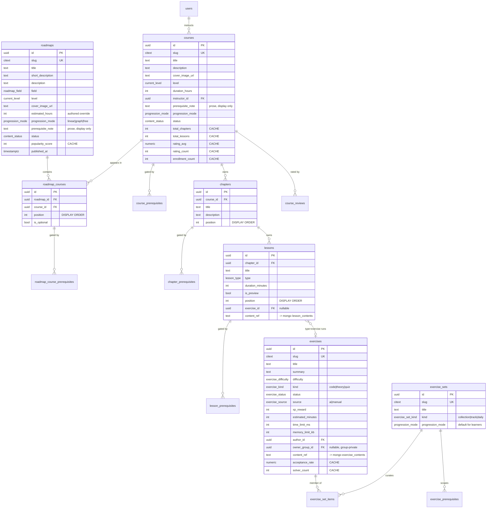
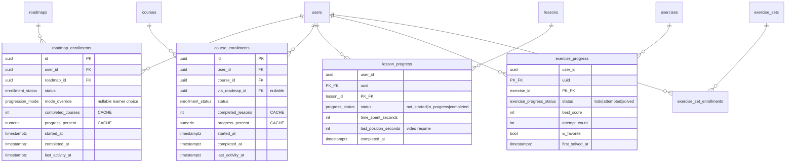
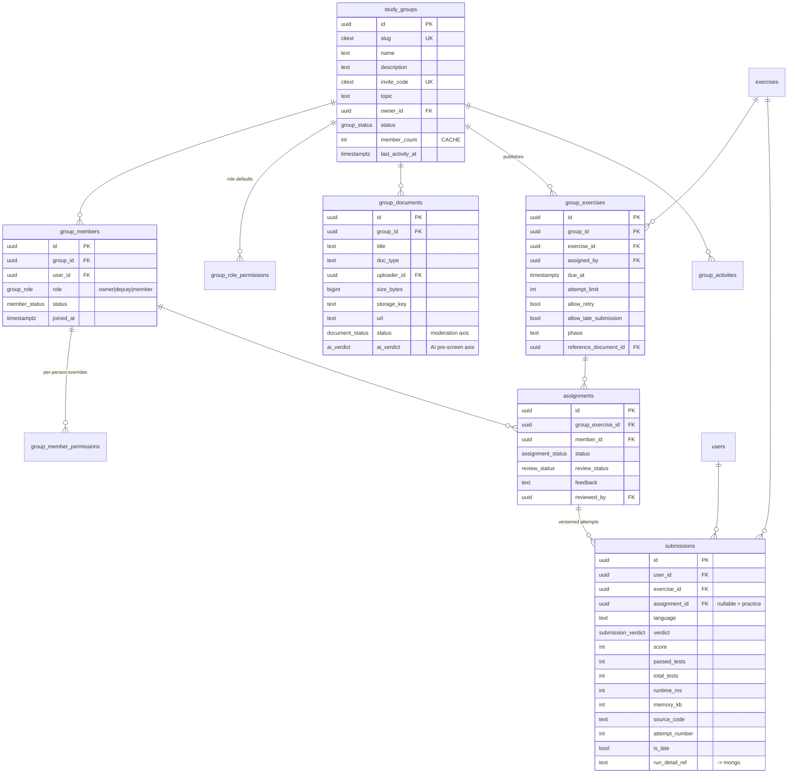

# Domain Model & PostgreSQL ERD

Derived from `00-frontend-review.md`. Every entity here traces to something the frontend actually
does; nothing was added speculatively. Grouped into five bounded contexts.

## 0. Contexts at a glance

| Context | Owns | Store |
| --- | --- | --- |
| Identity & personalisation | users, preferences, cached stats | PostgreSQL |
| Taxonomy | technologies, tags, companies | PostgreSQL |
| Learning content | roadmaps → courses → chapters → lessons, exercises, exercise sets | PostgreSQL (spine) + MongoDB (bodies) |
| Progression | enrolments, per-user progress, dependency evaluation | PostgreSQL |
| Collaboration | study groups, documents, assignments, submissions | PostgreSQL (+ MongoDB run details) |

## 1. Identity & personalisation

```mermaid
erDiagram
    users ||--o| user_stats : "cached totals"
    users ||--o| learning_preferences : "survey"
    learning_preferences ||--o{ learning_preference_technologies : "interested in"
    learning_preferences ||--o{ study_schedule_slots : "weekly plan"
    technologies ||--o{ learning_preference_technologies : ""

    users {
        uuid id PK
        citext email UK "required, unique"
        text password_hash
        citext handle UK "nullable, unique"
        text display_name
        text bio
        text avatar_url
        text website_url
        text github_handle
        platform_role role "learner|mentor|admin"
        account_status status "active|suspended|deleted"
        timestamptz email_verified_at
        timestamptz last_active_at
        timestamptz created_at
    }
    user_stats {
        uuid user_id PK_FK
        int xp "CACHE"
        int solved_count "CACHE"
        int current_streak_days "CACHE"
        int longest_streak_days "CACHE"
        date last_solved_on
    }
    learning_preferences {
        uuid user_id PK_FK
        text learning_goal
        current_level current_level
        roadmap_field[] interested_fields
        learning_style[] preferred_learning_styles
        int weekly_study_hours
        text career_goal
        content_priority content_priority
        bool reminders_enabled
        time reminder_time
        bool adaptive_recommendations
    }
    study_schedule_slots {
        uuid user_id PK_FK
        weekday weekday PK
        bool enabled
        time start_time
        int duration_minutes
    }
```

`user_stats` is split from `users` deliberately: it is a **write-hot cache** (updated on every
accepted submission) while `users` is read-hot and rarely written. Keeping them apart avoids row
contention on the identity record.

`interested_fields` and `preferred_learning_styles` are **native enum arrays**, not JSON — they are
typed, constrained, and GIN-indexable. `study_schedule_slots` is a real table because the reminder
scheduler must query *"which users have a session starting at 19:00 on Monday"* across all users.

## 2. Learning content



Key structural decisions:

- **`roadmap_courses` is a first-class entity, not a plain join.** Position and gating are properties
  of *"this course inside this roadmap"*, not of the course. The same course can sit at position 2
  in one roadmap with prerequisites and at position 5 in another with none. Prerequisite edges
  therefore reference `roadmap_courses.id`, not `courses.id`.
- **Two levels of course prerequisite.** `course_prerequisites` is *intrinsic* ("Spring Boot REST API
  needs Java Core, wherever you meet it"); `roadmap_course_prerequisites` is *curricular* (this
  roadmap's chosen sequence). The frontend conflates them into one prose array; the domain does not.
- **`exercises` keeps a relational spine** even though its body lives in MongoDB — because
  dependencies, progress, assignments and set membership all need enforceable foreign keys. See
  `04-design-decisions.md §1`.
- **`content_ref`** is the MongoDB `_id` as text. It is nullable while content is being authored.

## 3. Progression



### 3.1 What is persisted vs derived vs cached

| Level | Treatment | Why |
| --- | --- | --- |
| Lesson progress | **Persisted** (source of truth) | Irreducible fact — only the learner's action produces it |
| Exercise progress | **Persisted** (source of truth) | Derived from submissions, but `is_favorite` and `status` are needed without scanning submissions |
| Chapter progress | **Derived at read time** | `count(completed lessons in chapter) / count(lessons in chapter)` — cheap, always consistent, and no screen sorts or filters by it |
| Course progress | **Cached** on `course_enrollments` | Rendered on every card in every grid; recomputing across all lessons per card is O(cards × lessons). Refreshed by trigger on `lesson_progress` change |
| Roadmap progress | **Cached** on `roadmap_enrollments` | Same reason; refreshed by trigger on `course_enrollments` change |

The caches are strictly *derived values with a stated invariant*, never independently writable:

```
course_enrollments.completed_lessons
  = count(lesson_progress WHERE user=U AND status='completed' AND lesson ∈ course C)

roadmap_enrollments.completed_courses
  = count(course_enrollments WHERE user=U AND status='completed' AND course ∈ roadmap R)
```

`postgres/migrations/0012_progress_triggers.sql` maintains both, and
`scripts/verify.sql` re-derives them from scratch to assert the invariant holds.

**"Completed" is defined per level:**

| Entity | Completion condition |
| --- | --- |
| Lesson | `lesson_progress.status = 'completed'` (learner marks done / video finished) |
| Exercise | an accepted submission exists → `exercise_progress.status = 'solved'` |
| Chapter | all **non-optional** lessons in it completed |
| Course | all **non-optional** chapters completed |
| Roadmap course | that course's enrolment completed |

## 4. Collaboration



`submissions.assignment_id` being nullable is what unifies the frontend's
`origin: "Nhóm học tập" | "Bài luyện tập"` — a group submission has an assignment, a practice
submission does not. One table, no discriminator column needed.

Permissions are two layers, matching `effectiveMemberPermissions()` exactly:
`group_role_permissions` (per group, per role) overlaid by `group_member_permissions` (per person).
Owners are not stored — they are unconditionally permitted in the resolver, as in the frontend.

## 5. Relationship rules

| Relationship | Card. | Owner | Optional | On delete parent | Unique |
| --- | --- | --- | --- | --- | --- |
| roadmap → roadmap_courses | 1:N | roadmap | — | CASCADE | (roadmap_id, course_id) |
| course → roadmap_courses | 1:N | course | — | RESTRICT | — |
| course → chapters | 1:N | course | — | CASCADE | (course_id, position) |
| chapter → lessons | 1:N | chapter | — | CASCADE | (chapter_id, position) |
| lesson → exercise | N:1 | lesson | yes | SET NULL | — |
| exercise_set → items | 1:N | set | — | CASCADE | (set_id, exercise_id) |
| user → enrolments | 1:N | user | — | CASCADE | (user_id, course_id) |
| user → lesson_progress | 1:N | user | — | CASCADE | PK (user_id, lesson_id) |
| group → members | 1:N | group | — | CASCADE | (group_id, user_id) |
| group_exercise → assignments | 1:N | group_exercise | — | CASCADE | (group_exercise_id, member_id) |
| assignment → submissions | 1:N | assignment | yes | SET NULL | (user_id, exercise_id, attempt_number) |
| all `*_prerequisites` | N:M | the gated entity | — | CASCADE | (target, source, group_index) |

**RESTRICT on `courses`** is deliberate: deleting a course that a roadmap still references should
fail loudly rather than silently reshaping someone's curriculum. Content is retired with
`status = 'archived'`, not deleted — and `0010_dependency_guards.sql` refuses to add a prerequisite
pointing at archived content.
