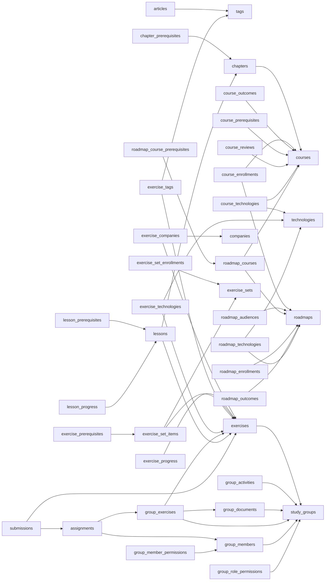

# Tham chiếu Schema — Toàn bộ bảng & quan hệ

> Sinh tự động từ database đang chạy bằng `scripts/dump-catalog.sh` + `scripts/gen-schema-doc.js`.
> **Không sửa tay** — chạy lại generator sau mỗi migration.
>
> **Đang cũ hơn schema thật:** `make schema-doc` hiện lỗi ở bước generator (`gen-schema-doc.js`
> báo "thiếu mô tả cho bảng: audit_logs, outbox, processed_events" — lỗi có trước, không liên quan
> tới thay đổi này) nên chưa regenerate được sau `0021_drop_unused_prerequisite_graph.sql`. File
> này vẫn còn liệt kê `roadmap_course_prerequisites`, `course_prerequisites`,
> `chapter_prerequisites`, `exercise_prerequisites` — 4 bảng đó **đã bị xoá**. Xem
> `02-dependency-model.md` cho hiện trạng thật; sửa `gen-schema-doc.js` rồi chạy lại generator để
> file này đúng lại.

PostgreSQL: **44 bảng**, **75 khoá ngoại**, **79 ràng buộc CHECK**.

Xem thêm: [mô hình miền](01-domain-model.md) · [mô hình phụ thuộc](02-dependency-model.md) · [MongoDB](03-mongodb-model.md)

## 1. Danh sách bảng theo ngữ cảnh

### Danh tính & cá nhân hoá

| Bảng | Vai trò |
| --- | --- |
| [`users`](#users) | Tài khoản nền tảng. Không xoá cứng — dùng `status='deleted'` để bài viết/bài nộp vẫn còn tác giả hợp lệ. |
| [`user_stats`](#user_stats) | **CACHE** tổng hợp hoạt động (XP, số bài giải, streak). Tách khỏi `users` vì ghi rất thường xuyên. |
| [`learning_preferences`](#learning_preferences) | Kết quả khảo sát onboarding — đầu vào cho thuật toán gợi ý lộ trình. |
| [`study_schedule_slots`](#study_schedule_slots) | Khung giờ học từng ngày trong tuần. Là bảng thật (không phải JSON) để scheduler truy vấn được “ai học lúc 19:00 thứ 2”. |

### Từ điển dùng chung

| Bảng | Vai trò |
| --- | --- |
| [`technologies`](#technologies) | Danh mục công nghệ chuẩn hoá, dùng chung cho roadmap/course/exercise/preference. |
| [`tags`](#tags) | Nhãn chủ đề tự do cho bài tập và bài viết. |
| [`companies`](#companies) | Công ty gắn với bài tập phỏng vấn (mục “Nhu cầu tuyển dụng”). |

### Nội dung học

| Bảng | Vai trò |
| --- | --- |
| [`roadmaps`](#roadmaps) | Lộ trình học — tập hợp nhiều khoá theo một hướng nghề nghiệp. |
| [`roadmap_outcomes`](#roadmap_outcomes) | Danh sách “học xong làm được gì”, có thứ tự. |
| [`roadmap_audiences`](#roadmap_audiences) | Đối tượng phù hợp với lộ trình, có thứ tự. |
| [`roadmap_technologies`](#roadmap_technologies) | N-N roadmap ↔ công nghệ. |
| [`courses`](#courses) | Khoá học. `progression_mode` quyết định cách khoá chương/bài bên trong. |
| [`course_outcomes`](#course_outcomes) | Mục tiêu đầu ra của khoá, có thứ tự. |
| [`course_technologies`](#course_technologies) | N-N khoá học ↔ công nghệ. |
| [`course_reviews`](#course_reviews) | Đánh giá của học viên — nguồn sự thật cho `courses.rating_avg`. |
| [`roadmap_courses`](#roadmap_courses) | **Thực thể hạng nhất**, không phải bảng nối thuần. Vị trí và điều kiện mở khoá thuộc về “khoá này trong lộ trình này”. |
| [`chapters`](#chapters) | Chương trong khoá học. `position` chỉ là thứ tự hiển thị. |
| [`lessons`](#lessons) | Bài học. `course_id` là cột phi chuẩn hoá nhưng được FK kép chứng minh luôn khớp chương cha. |

### Bài tập

| Bảng | Vai trò |
| --- | --- |
| [`exercises`](#exercises) | **Xương sống quan hệ** của bài tập. Phần nội dung nằm ở MongoDB qua `content_ref`. |
| [`exercise_tags`](#exercise_tags) | N-N bài tập ↔ nhãn. |
| [`exercise_technologies`](#exercise_technologies) | N-N bài tập ↔ công nghệ. |
| [`exercise_companies`](#exercise_companies) | N-N bài tập ↔ công ty. |
| [`exercise_sets`](#exercise_sets) | Bộ bài tập được tuyển chọn (“Top 100 phỏng vấn”, “Nhập môn thuật toán”). |
| [`exercise_set_items`](#exercise_set_items) | Thành viên của bộ + thứ tự hiển thị. |
| [`exercise_set_enrollments`](#exercise_set_enrollments) | Học viên tham gia bộ, kèm quyền tự chọn bật/tắt ràng buộc thứ tự. |

### Quan hệ phụ thuộc (điều kiện tiên quyết)

| Bảng | Vai trò |
| --- | --- |
| [`roadmap_course_prerequisites`](#roadmap_course_prerequisites) | Trình tự khoá học **theo từng lộ trình**. Trỏ tới `roadmap_courses.id`. |
| [`course_prerequisites`](#course_prerequisites) | Điều kiện **nội tại** của khoá, độc lập với mọi lộ trình. |
| [`chapter_prerequisites`](#chapter_prerequisites) | Phụ thuộc giữa các chương trong cùng một khoá. |
| [`lesson_prerequisites`](#lesson_prerequisites) | Phụ thuộc giữa các bài trong cùng một khoá (cho phép xuyên chương). |
| [`exercise_prerequisites`](#exercise_prerequisites) | Phụ thuộc giữa bài tập, **phạm vi theo bộ** — nên cùng một bài có thể bị khoá ở bộ này và tự do ở bộ khác. |

### Ghi danh & tiến độ

| Bảng | Vai trò |
| --- | --- |
| [`roadmap_enrollments`](#roadmap_enrollments) | Ghi danh lộ trình + **cache** tiến độ, do trigger cập nhật. |
| [`course_enrollments`](#course_enrollments) | Ghi danh khoá học + **cache** tiến độ. `mode_override` cho phép học viên tự chọn chế độ. |
| [`lesson_progress`](#lesson_progress) | **NGUỒN SỰ THẬT** cho mọi phần trăm tiến độ. |
| [`exercise_progress`](#exercise_progress) | Trạng thái luyện tập của từng học viên (todo/attempted/solved, yêu thích). |

### Nhóm học tập & bài nộp

| Bảng | Vai trò |
| --- | --- |
| [`study_groups`](#study_groups) | Nhóm học tập, có mã mời duy nhất. |
| [`group_members`](#group_members) | Thành viên nhóm + vai trò. Ràng buộc mỗi nhóm đúng 1 owner. |
| [`group_role_permissions`](#group_role_permissions) | Quyền mặc định theo vai trò, cấu hình riêng từng nhóm. Owner không lưu (luôn full quyền). |
| [`group_member_permissions`](#group_member_permissions) | Ghi đè quyền cho từng cá nhân, chồng lên quyền vai trò. |
| [`group_documents`](#group_documents) | Tài liệu nhóm. `status` (người duyệt) và `ai_verdict` (AI tiền kiểm) là **hai trục độc lập**. |
| [`group_exercises`](#group_exercises) | Việc xuất bản một bài tập vào nhóm: hạn nộp, số lần thử, giai đoạn. |
| [`assignments`](#assignments) | Nghĩa vụ của một thành viên với một bài đã giao. |
| [`submissions`](#submissions) | Bài nộp. `assignment_id` NULL = luyện tập tự do, có giá trị = nộp cho nhóm. |
| [`group_activities`](#group_activities) | Nhật ký hoạt động của nhóm. |

### Nội dung biên tập

| Bảng | Vai trò |
| --- | --- |
| [`articles`](#articles) | Bài viết. Phần thân (sections) nằm ở MongoDB qua `content_ref`. |

## 2. Bản đồ quan hệ

Mũi tên đi từ bảng **chứa khoá ngoại** tới bảng **được tham chiếu**.

*(`users` được lược khỏi sơ đồ vì gần như mọi bảng đều tham chiếu tới nó.)*

## 3. Chi tiết từng bảng

---

## Danh tính & cá nhân hoá

### `users`

Tài khoản nền tảng. Không xoá cứng — dùng `status='deleted'` để bài viết/bài nộp vẫn còn tác giả hợp lệ.

| # | Cột | Kiểu | Null | Mặc định |
| --- | --- | --- | --- | --- |
| 1 | `id` | `uuid` | NOT NULL | `gen_random_uuid()` |
| 2 | `email` | `citext` | NOT NULL |  |
| 3 | `password_hash` | `text` |  |  |
| 4 | `handle` | `citext` |  |  |
| 5 | `display_name` | `text` | NOT NULL |  |
| 6 | `bio` | `text` |  |  |
| 7 | `avatar_url` | `text` |  |  |
| 8 | `website_url` | `text` |  |  |
| 9 | `github_handle` | `text` |  |  |
| 10 | `role` | `platform_role` | NOT NULL | `'learner'::platform_role` |
| 11 | `status` | `account_status` | NOT NULL | `'active'::account_status` |
| 12 | `locale` | `text` | NOT NULL | `'vi'::text` |
| 13 | `timezone` | `text` | NOT NULL | `'Asia/Ho_Chi_Minh'::text` |
| 14 | `email_verified_at` | `timestamp with time zone` |  |  |
| 15 | `last_active_at` | `timestamp with time zone` |  |  |
| 16 | `created_at` | `timestamp with time zone` | NOT NULL | `now()` |
| 17 | `updated_at` | `timestamp with time zone` | NOT NULL | `now()` |

**Khoá & ràng buộc duy nhất**

- `users_pkey` — PRIMARY KEY (id)
- `users_email_key` — UNIQUE (email)
- `users_handle_key` — UNIQUE (handle)

**Được tham chiếu bởi**

`articles.author_id` · `assignments.reviewed_by` · `course_enrollments.user_id` · `course_reviews.user_id` · `courses.created_by` · `courses.instructor_id` · `exercise_progress.user_id` · `exercise_set_enrollments.user_id` · `exercise_sets.created_by` · `exercises.author_id` · `group_activities.actor_id` · `group_documents.reviewed_by` · `group_documents.uploader_id` · `group_exercises.assigned_by` · `group_members.user_id` · `learning_preferences.user_id` · `lesson_progress.user_id` · `roadmap_enrollments.user_id` · `roadmaps.created_by` · `study_groups.owner_id` · `study_schedule_slots.user_id` · `submissions.user_id` · `user_stats.user_id`

<strong>Ràng buộc CHECK</strong> (2)

- `users_display_name_not_blank` — `CHECK ((btrim(display_name) <> ''::text))`
- `users_handle_format` — `CHECK (((handle IS NULL) OR (handle ~ '^[a-z0-9](?:[a-z0-9_-]{1,28}[a-z0-9])$'::citext)))`

### `user_stats`

**CACHE** tổng hợp hoạt động (XP, số bài giải, streak). Tách khỏi `users` vì ghi rất thường xuyên.

| # | Cột | Kiểu | Null | Mặc định |
| --- | --- | --- | --- | --- |
| 1 | `user_id` | `uuid` | NOT NULL |  |
| 2 | `xp` | `integer` | NOT NULL | `0` |
| 3 | `solved_count` | `integer` | NOT NULL | `0` |
| 4 | `current_streak_days` | `integer` | NOT NULL | `0` |
| 5 | `longest_streak_days` | `integer` | NOT NULL | `0` |
| 6 | `last_solved_on` | `date` |  |  |
| 7 | `updated_at` | `timestamp with time zone` | NOT NULL | `now()` |

**Khoá & ràng buộc duy nhất**

- `user_stats_pkey` — PRIMARY KEY (user_id)

**Khoá ngoại (đi ra)**

| Cột | → Bảng đích | ON DELETE |
| --- | --- | --- |
| `user_id` | `users` (`id`) | CASCADE |

<strong>Ràng buộc CHECK</strong> (5)

- `user_stats_current_streak_days_check` — `CHECK ((current_streak_days >= 0))`
- `user_stats_longest_streak_days_check` — `CHECK ((longest_streak_days >= 0))`
- `user_stats_solved_count_check` — `CHECK ((solved_count >= 0))`
- `user_stats_streak_ordering` — `CHECK ((longest_streak_days >= current_streak_days))`
- `user_stats_xp_check` — `CHECK ((xp >= 0))`

### `learning_preferences`

Kết quả khảo sát onboarding — đầu vào cho thuật toán gợi ý lộ trình.

| # | Cột | Kiểu | Null | Mặc định |
| --- | --- | --- | --- | --- |
| 1 | `user_id` | `uuid` | NOT NULL |  |
| 2 | `learning_goal` | `text` |  |  |
| 3 | `career_goal` | `text` |  |  |
| 4 | `current_level` | `current_level` |  |  |
| 5 | `content_priority` | `content_priority` |  |  |
| 6 | `weekly_study_hours` | `integer` |  |  |
| 7 | `interested_fields` | `roadmap_field[]` | NOT NULL | `'{}'::roadmap_field[]` |
| 8 | `preferred_learning_styles` | `learning_style[]` | NOT NULL | `'{}'::learning_style[]` |
| 9 | `reminders_enabled` | `boolean` | NOT NULL | `true` |
| 10 | `reminder_time` | `time without time zone` |  |  |
| 11 | `adaptive_recommendations` | `boolean` | NOT NULL | `true` |
| 12 | `completed_at` | `timestamp with time zone` |  |  |
| 13 | `created_at` | `timestamp with time zone` | NOT NULL | `now()` |
| 14 | `updated_at` | `timestamp with time zone` | NOT NULL | `now()` |

**Khoá & ràng buộc duy nhất**

- `learning_preferences_pkey` — PRIMARY KEY (user_id)

**Khoá ngoại (đi ra)**

| Cột | → Bảng đích | ON DELETE |
| --- | --- | --- |
| `user_id` | `users` (`id`) | CASCADE |

<strong>Ràng buộc CHECK</strong> (2)

- `learning_preferences_reminder_needs_time` — `CHECK (((NOT reminders_enabled) OR (reminder_time IS NOT NULL)))`
- `learning_preferences_weekly_study_hours_check` — `CHECK (((weekly_study_hours IS NULL) OR ((weekly_study_hours >= 0) AND (weekly_study_hours <= 168))))`

### `study_schedule_slots`

Khung giờ học từng ngày trong tuần. Là bảng thật (không phải JSON) để scheduler truy vấn được “ai học lúc 19:00 thứ 2”.

| # | Cột | Kiểu | Null | Mặc định |
| --- | --- | --- | --- | --- |
| 1 | `user_id` | `uuid` | NOT NULL |  |
| 2 | `weekday` | `weekday` | NOT NULL |  |
| 3 | `enabled` | `boolean` | NOT NULL | `false` |
| 4 | `start_time` | `time without time zone` | NOT NULL |  |
| 5 | `duration_minutes` | `integer` | NOT NULL |  |

**Khoá & ràng buộc duy nhất**

- `study_schedule_slots_pkey` — PRIMARY KEY (user_id, weekday)

**Khoá ngoại (đi ra)**

| Cột | → Bảng đích | ON DELETE |
| --- | --- | --- |
| `user_id` | `users` (`id`) | CASCADE |

<strong>Ràng buộc CHECK</strong> (1)

- `study_schedule_slots_duration_minutes_check` — `CHECK (((duration_minutes >= 5) AND (duration_minutes <= 1440)))`

---

## Từ điển dùng chung

### `technologies`

Danh mục công nghệ chuẩn hoá, dùng chung cho roadmap/course/exercise/preference.

| # | Cột | Kiểu | Null | Mặc định |
| --- | --- | --- | --- | --- |
| 1 | `id` | `uuid` | NOT NULL | `gen_random_uuid()` |
| 2 | `slug` | `citext` | NOT NULL |  |
| 3 | `name` | `text` | NOT NULL |  |
| 4 | `created_at` | `timestamp with time zone` | NOT NULL | `now()` |

**Khoá & ràng buộc duy nhất**

- `technologies_pkey` — PRIMARY KEY (id)
- `technologies_slug_key` — UNIQUE (slug)

**Được tham chiếu bởi**

`course_technologies.technology_id` · `exercise_technologies.technology_id` · `roadmap_technologies.technology_id`

<strong>Ràng buộc CHECK</strong> (1)

- `technologies_name_not_blank` — `CHECK ((btrim(name) <> ''::text))`

### `tags`

Nhãn chủ đề tự do cho bài tập và bài viết.

| # | Cột | Kiểu | Null | Mặc định |
| --- | --- | --- | --- | --- |
| 1 | `id` | `uuid` | NOT NULL | `gen_random_uuid()` |
| 2 | `slug` | `citext` | NOT NULL |  |
| 3 | `name` | `text` | NOT NULL |  |
| 4 | `created_at` | `timestamp with time zone` | NOT NULL | `now()` |

**Khoá & ràng buộc duy nhất**

- `tags_pkey` — PRIMARY KEY (id)
- `tags_slug_key` — UNIQUE (slug)

**Được tham chiếu bởi**

`articles.tag_id` · `exercise_tags.tag_id`

### `companies`

Công ty gắn với bài tập phỏng vấn (mục “Nhu cầu tuyển dụng”).

| # | Cột | Kiểu | Null | Mặc định |
| --- | --- | --- | --- | --- |
| 1 | `id` | `uuid` | NOT NULL | `gen_random_uuid()` |
| 2 | `slug` | `citext` | NOT NULL |  |
| 3 | `name` | `text` | NOT NULL |  |
| 4 | `logo_url` | `text` |  |  |
| 5 | `created_at` | `timestamp with time zone` | NOT NULL | `now()` |

**Khoá & ràng buộc duy nhất**

- `companies_pkey` — PRIMARY KEY (id)
- `companies_slug_key` — UNIQUE (slug)

**Được tham chiếu bởi**

`exercise_companies.company_id`

---

## Nội dung học

### `roadmaps`

Lộ trình học — tập hợp nhiều khoá theo một hướng nghề nghiệp.

| # | Cột | Kiểu | Null | Mặc định |
| --- | --- | --- | --- | --- |
| 1 | `id` | `uuid` | NOT NULL | `gen_random_uuid()` |
| 2 | `slug` | `citext` | NOT NULL |  |
| 3 | `title` | `text` | NOT NULL |  |
| 4 | `short_description` | `text` |  |  |
| 5 | `description` | `text` |  |  |
| 6 | `field` | `roadmap_field` | NOT NULL |  |
| 7 | `level` | `current_level` | NOT NULL |  |
| 8 | `cover_image_url` | `text` |  |  |
| 9 | `estimated_hours` | `integer` |  |  |
| 10 | `progression_mode` | `progression_mode` | NOT NULL | `'graph'::progression_mode` |
| 11 | `prerequisite_note` | `text` |  |  |
| 12 | `status` | `content_status` | NOT NULL | `'draft'::content_status` |
| 13 | `popularity_score` | `integer` | NOT NULL | `0` |
| 14 | `created_by` | `uuid` |  |  |
| 15 | `published_at` | `timestamp with time zone` |  |  |
| 16 | `created_at` | `timestamp with time zone` | NOT NULL | `now()` |
| 17 | `updated_at` | `timestamp with time zone` | NOT NULL | `now()` |

**Khoá & ràng buộc duy nhất**

- `roadmaps_pkey` — PRIMARY KEY (id)
- `roadmaps_slug_key` — UNIQUE (slug)

**Khoá ngoại (đi ra)**

| Cột | → Bảng đích | ON DELETE |
| --- | --- | --- |
| `created_by` | `users` (`id`) | SET NULL |

**Được tham chiếu bởi**

`course_enrollments.via_roadmap_id` · `roadmap_audiences.roadmap_id` · `roadmap_courses.roadmap_id` · `roadmap_enrollments.roadmap_id` · `roadmap_outcomes.roadmap_id` · `roadmap_technologies.roadmap_id`

<strong>Ràng buộc CHECK</strong> (3)

- `roadmaps_estimated_hours_check` — `CHECK (((estimated_hours IS NULL) OR (estimated_hours > 0)))`
- `roadmaps_popularity_score_check` — `CHECK (((popularity_score >= 0) AND (popularity_score <= 100)))`
- `roadmaps_published_needs_date` — `CHECK (((status <> 'published'::content_status) OR (published_at IS NOT NULL)))`

### `roadmap_outcomes`

Danh sách “học xong làm được gì”, có thứ tự.

| # | Cột | Kiểu | Null | Mặc định |
| --- | --- | --- | --- | --- |
| 1 | `roadmap_id` | `uuid` | NOT NULL |  |
| 2 | `position` | `integer` | NOT NULL |  |
| 3 | `text` | `text` | NOT NULL |  |

**Khoá & ràng buộc duy nhất**

- `roadmap_outcomes_pkey` — PRIMARY KEY (roadmap_id, "position")

**Khoá ngoại (đi ra)**

| Cột | → Bảng đích | ON DELETE |
| --- | --- | --- |
| `roadmap_id` | `roadmaps` (`id`) | CASCADE |

<strong>Ràng buộc CHECK</strong> (1)

- `roadmap_outcomes_position_check` — `CHECK (("position" > 0))`

### `roadmap_audiences`

Đối tượng phù hợp với lộ trình, có thứ tự.

| # | Cột | Kiểu | Null | Mặc định |
| --- | --- | --- | --- | --- |
| 1 | `roadmap_id` | `uuid` | NOT NULL |  |
| 2 | `position` | `integer` | NOT NULL |  |
| 3 | `text` | `text` | NOT NULL |  |

**Khoá & ràng buộc duy nhất**

- `roadmap_audiences_pkey` — PRIMARY KEY (roadmap_id, "position")

**Khoá ngoại (đi ra)**

| Cột | → Bảng đích | ON DELETE |
| --- | --- | --- |
| `roadmap_id` | `roadmaps` (`id`) | CASCADE |

<strong>Ràng buộc CHECK</strong> (1)

- `roadmap_audiences_position_check` — `CHECK (("position" > 0))`

### `roadmap_technologies`

N-N roadmap ↔ công nghệ.

| # | Cột | Kiểu | Null | Mặc định |
| --- | --- | --- | --- | --- |
| 1 | `roadmap_id` | `uuid` | NOT NULL |  |
| 2 | `technology_id` | `uuid` | NOT NULL |  |

**Khoá & ràng buộc duy nhất**

- `roadmap_technologies_pkey` — PRIMARY KEY (roadmap_id, technology_id)

**Khoá ngoại (đi ra)**

| Cột | → Bảng đích | ON DELETE |
| --- | --- | --- |
| `roadmap_id` | `roadmaps` (`id`) | CASCADE |
| `technology_id` | `technologies` (`id`) | RESTRICT |

### `courses`

Khoá học. `progression_mode` quyết định cách khoá chương/bài bên trong.

| # | Cột | Kiểu | Null | Mặc định |
| --- | --- | --- | --- | --- |
| 1 | `id` | `uuid` | NOT NULL | `gen_random_uuid()` |
| 2 | `slug` | `citext` | NOT NULL |  |
| 3 | `title` | `text` | NOT NULL |  |
| 4 | `description` | `text` |  |  |
| 5 | `cover_image_url` | `text` |  |  |
| 6 | `level` | `current_level` | NOT NULL |  |
| 7 | `duration_hours` | `integer` |  |  |
| 8 | `instructor_id` | `uuid` |  |  |
| 9 | `prerequisite_note` | `text` |  |  |
| 10 | `progression_mode` | `progression_mode` | NOT NULL | `'graph'::progression_mode` |
| 11 | `status` | `content_status` | NOT NULL | `'draft'::content_status` |
| 12 | `total_chapters` | `integer` | NOT NULL | `0` |
| 13 | `total_lessons` | `integer` | NOT NULL | `0` |
| 14 | `rating_avg` | `numeric(3,2)` |  |  |
| 15 | `rating_count` | `integer` | NOT NULL | `0` |
| 16 | `enrollment_count` | `integer` | NOT NULL | `0` |
| 17 | `created_by` | `uuid` |  |  |
| 18 | `published_at` | `timestamp with time zone` |  |  |
| 19 | `created_at` | `timestamp with time zone` | NOT NULL | `now()` |
| 20 | `updated_at` | `timestamp with time zone` | NOT NULL | `now()` |

**Khoá & ràng buộc duy nhất**

- `courses_pkey` — PRIMARY KEY (id)
- `courses_slug_key` — UNIQUE (slug)

**Khoá ngoại (đi ra)**

| Cột | → Bảng đích | ON DELETE |
| --- | --- | --- |
| `created_by` | `users` (`id`) | SET NULL |
| `instructor_id` | `users` (`id`) | SET NULL |

**Được tham chiếu bởi**

`chapters.course_id` · `course_enrollments.course_id` · `course_outcomes.course_id` · `course_prerequisites.source_course_id` · `course_prerequisites.target_course_id` · `course_reviews.course_id` · `course_technologies.course_id` · `roadmap_courses.course_id`

<strong>Ràng buộc CHECK</strong> (7)

- `courses_duration_hours_check` — `CHECK (((duration_hours IS NULL) OR (duration_hours > 0)))`
- `courses_enrollment_count_check` — `CHECK ((enrollment_count >= 0))`
- `courses_published_needs_date` — `CHECK (((status <> 'published'::content_status) OR (published_at IS NOT NULL)))`
- `courses_rating_avg_check` — `CHECK (((rating_avg IS NULL) OR ((rating_avg >= (1)::numeric) AND (rating_avg <= (5)::numeric))))`
- `courses_rating_count_check` — `CHECK ((rating_count >= 0))`
- `courses_total_chapters_check` — `CHECK ((total_chapters >= 0))`
- `courses_total_lessons_check` — `CHECK ((total_lessons >= 0))`

### `course_outcomes`

Mục tiêu đầu ra của khoá, có thứ tự.

| # | Cột | Kiểu | Null | Mặc định |
| --- | --- | --- | --- | --- |
| 1 | `course_id` | `uuid` | NOT NULL |  |
| 2 | `position` | `integer` | NOT NULL |  |
| 3 | `text` | `text` | NOT NULL |  |

**Khoá & ràng buộc duy nhất**

- `course_outcomes_pkey` — PRIMARY KEY (course_id, "position")

**Khoá ngoại (đi ra)**

| Cột | → Bảng đích | ON DELETE |
| --- | --- | --- |
| `course_id` | `courses` (`id`) | CASCADE |

<strong>Ràng buộc CHECK</strong> (1)

- `course_outcomes_position_check` — `CHECK (("position" > 0))`

### `course_technologies`

N-N khoá học ↔ công nghệ.

| # | Cột | Kiểu | Null | Mặc định |
| --- | --- | --- | --- | --- |
| 1 | `course_id` | `uuid` | NOT NULL |  |
| 2 | `technology_id` | `uuid` | NOT NULL |  |

**Khoá & ràng buộc duy nhất**

- `course_technologies_pkey` — PRIMARY KEY (course_id, technology_id)

**Khoá ngoại (đi ra)**

| Cột | → Bảng đích | ON DELETE |
| --- | --- | --- |
| `course_id` | `courses` (`id`) | CASCADE |
| `technology_id` | `technologies` (`id`) | RESTRICT |

### `course_reviews`

Đánh giá của học viên — nguồn sự thật cho `courses.rating_avg`.

| # | Cột | Kiểu | Null | Mặc định |
| --- | --- | --- | --- | --- |
| 1 | `id` | `uuid` | NOT NULL | `gen_random_uuid()` |
| 2 | `course_id` | `uuid` | NOT NULL |  |
| 3 | `user_id` | `uuid` | NOT NULL |  |
| 4 | `rating` | `smallint` | NOT NULL |  |
| 5 | `comment` | `text` |  |  |
| 6 | `created_at` | `timestamp with time zone` | NOT NULL | `now()` |
| 7 | `updated_at` | `timestamp with time zone` | NOT NULL | `now()` |

**Khoá & ràng buộc duy nhất**

- `course_reviews_pkey` — PRIMARY KEY (id)
- `course_reviews_course_id_user_id_key` — UNIQUE (course_id, user_id)

**Khoá ngoại (đi ra)**

| Cột | → Bảng đích | ON DELETE |
| --- | --- | --- |
| `course_id` | `courses` (`id`) | CASCADE |
| `user_id` | `users` (`id`) | CASCADE |

<strong>Ràng buộc CHECK</strong> (1)

- `course_reviews_rating_check` — `CHECK (((rating >= 1) AND (rating <= 5)))`

### `roadmap_courses`

**Thực thể hạng nhất**, không phải bảng nối thuần. Vị trí và điều kiện mở khoá thuộc về “khoá này trong lộ trình này”.

| # | Cột | Kiểu | Null | Mặc định |
| --- | --- | --- | --- | --- |
| 1 | `id` | `uuid` | NOT NULL | `gen_random_uuid()` |
| 2 | `roadmap_id` | `uuid` | NOT NULL |  |
| 3 | `course_id` | `uuid` | NOT NULL |  |
| 4 | `position` | `integer` | NOT NULL |  |
| 5 | `is_optional` | `boolean` | NOT NULL | `false` |
| 6 | `created_at` | `timestamp with time zone` | NOT NULL | `now()` |

**Khoá & ràng buộc duy nhất**

- `roadmap_courses_pkey` — PRIMARY KEY (id)
- `roadmap_courses_id_roadmap_unique` — UNIQUE (roadmap_id, id)
- `roadmap_courses_position_unique` — UNIQUE (roadmap_id, "position") DEFERRABLE
- `roadmap_courses_roadmap_id_course_id_key` — UNIQUE (roadmap_id, course_id)

**Khoá ngoại (đi ra)**

| Cột | → Bảng đích | ON DELETE |
| --- | --- | --- |
| `course_id` | `courses` (`id`) | RESTRICT |
| `roadmap_id` | `roadmaps` (`id`) | CASCADE |

**Được tham chiếu bởi**

`roadmap_course_prerequisites.roadmap_id,source_roadmap_course_id` · `roadmap_course_prerequisites.roadmap_id,target_roadmap_course_id`

<strong>Ràng buộc CHECK</strong> (1)

- `roadmap_courses_position_check` — `CHECK (("position" > 0))`

### `chapters`

Chương trong khoá học. `position` chỉ là thứ tự hiển thị.

| # | Cột | Kiểu | Null | Mặc định |
| --- | --- | --- | --- | --- |
| 1 | `id` | `uuid` | NOT NULL | `gen_random_uuid()` |
| 2 | `course_id` | `uuid` | NOT NULL |  |
| 3 | `title` | `text` | NOT NULL |  |
| 4 | `description` | `text` |  |  |
| 5 | `position` | `integer` | NOT NULL |  |
| 6 | `is_optional` | `boolean` | NOT NULL | `false` |
| 7 | `created_at` | `timestamp with time zone` | NOT NULL | `now()` |
| 8 | `updated_at` | `timestamp with time zone` | NOT NULL | `now()` |

**Khoá & ràng buộc duy nhất**

- `chapters_pkey` — PRIMARY KEY (id)
- `chapters_id_course_unique` — UNIQUE (course_id, id)
- `chapters_position_unique` — UNIQUE (course_id, "position") DEFERRABLE

**Khoá ngoại (đi ra)**

| Cột | → Bảng đích | ON DELETE |
| --- | --- | --- |
| `course_id` | `courses` (`id`) | CASCADE |

**Được tham chiếu bởi**

`chapter_prerequisites.course_id,source_chapter_id` · `chapter_prerequisites.course_id,target_chapter_id` · `lessons.chapter_id` · `lessons.course_id,chapter_id`

<strong>Ràng buộc CHECK</strong> (1)

- `chapters_position_check` — `CHECK (("position" > 0))`

### `lessons`

Bài học. `course_id` là cột phi chuẩn hoá nhưng được FK kép chứng minh luôn khớp chương cha.

| # | Cột | Kiểu | Null | Mặc định |
| --- | --- | --- | --- | --- |
| 1 | `id` | `uuid` | NOT NULL | `gen_random_uuid()` |
| 2 | `chapter_id` | `uuid` | NOT NULL |  |
| 3 | `course_id` | `uuid` | NOT NULL |  |
| 4 | `title` | `text` | NOT NULL |  |
| 5 | `type` | `lesson_type` | NOT NULL |  |
| 6 | `duration_minutes` | `integer` |  |  |
| 7 | `is_preview` | `boolean` | NOT NULL | `false` |
| 8 | `is_optional` | `boolean` | NOT NULL | `false` |
| 9 | `position` | `integer` | NOT NULL |  |
| 10 | `exercise_id` | `uuid` |  |  |
| 11 | `content_ref` | `text` |  |  |
| 12 | `created_at` | `timestamp with time zone` | NOT NULL | `now()` |
| 13 | `updated_at` | `timestamp with time zone` | NOT NULL | `now()` |

**Khoá & ràng buộc duy nhất**

- `lessons_pkey` — PRIMARY KEY (id)
- `lessons_id_course_unique` — UNIQUE (course_id, id)
- `lessons_position_unique` — UNIQUE (chapter_id, "position") DEFERRABLE

**Khoá ngoại (đi ra)**

| Cột | → Bảng đích | ON DELETE |
| --- | --- | --- |
| `chapter_id` | `chapters` (`id`) | CASCADE |
| `course_id,chapter_id` | `chapters` (`course_id,id`) | CASCADE |
| `exercise_id` | `exercises` (`id`) | SET NULL |

**Được tham chiếu bởi**

`lesson_prerequisites.course_id,source_lesson_id` · `lesson_prerequisites.course_id,target_lesson_id` · `lesson_progress.lesson_id`

<strong>Ràng buộc CHECK</strong> (3)

- `lessons_duration_minutes_check` — `CHECK (((duration_minutes IS NULL) OR (duration_minutes > 0)))`
- `lessons_exercise_only_for_exercise_types` — `CHECK (((exercise_id IS NULL) OR (type = ANY (ARRAY['exercise'::lesson_type, 'quiz'::lesson_type, 'challenge'::lesson_type, 'project'::lesson_type]))))`
- `lessons_position_check` — `CHECK (("position" > 0))`

---

## Bài tập

### `exercises`

**Xương sống quan hệ** của bài tập. Phần nội dung nằm ở MongoDB qua `content_ref`.

| # | Cột | Kiểu | Null | Mặc định |
| --- | --- | --- | --- | --- |
| 1 | `id` | `uuid` | NOT NULL | `gen_random_uuid()` |
| 2 | `slug` | `citext` | NOT NULL |  |
| 3 | `title` | `text` | NOT NULL |  |
| 4 | `summary` | `text` |  |  |
| 5 | `kind` | `exercise_kind` | NOT NULL | `'code'::exercise_kind` |
| 6 | `difficulty` | `exercise_difficulty` | NOT NULL |  |
| 7 | `status` | `exercise_status` | NOT NULL | `'draft'::exercise_status` |
| 8 | `source` | `exercise_source` | NOT NULL | `'manual'::exercise_source` |
| 9 | `xp_reward` | `integer` | NOT NULL | `0` |
| 10 | `estimated_minutes` | `integer` |  |  |
| 11 | `time_limit_ms` | `integer` | NOT NULL | `1000` |
| 12 | `memory_limit_kb` | `integer` | NOT NULL | `262144` |
| 13 | `author_id` | `uuid` |  |  |
| 14 | `owner_group_id` | `uuid` |  |  |
| 15 | `content_ref` | `text` |  |  |
| 16 | `acceptance_rate` | `numeric(5,2)` |  |  |
| 17 | `solver_count` | `integer` | NOT NULL | `0` |
| 18 | `attempt_count` | `integer` | NOT NULL | `0` |
| 19 | `published_at` | `timestamp with time zone` |  |  |
| 20 | `created_at` | `timestamp with time zone` | NOT NULL | `now()` |
| 21 | `updated_at` | `timestamp with time zone` | NOT NULL | `now()` |

**Khoá & ràng buộc duy nhất**

- `exercises_pkey` — PRIMARY KEY (id)
- `exercises_slug_key` — UNIQUE (slug)

**Khoá ngoại (đi ra)**

| Cột | → Bảng đích | ON DELETE |
| --- | --- | --- |
| `author_id` | `users` (`id`) | SET NULL |
| `owner_group_id` | `study_groups` (`id`) | CASCADE |

**Được tham chiếu bởi**

`exercise_companies.exercise_id` · `exercise_progress.exercise_id` · `exercise_set_items.exercise_id` · `exercise_tags.exercise_id` · `exercise_technologies.exercise_id` · `group_exercises.exercise_id` · `lessons.exercise_id` · `submissions.exercise_id`

<strong>Ràng buộc CHECK</strong> (9)

- `exercises_acceptance_rate_check` — `CHECK (((acceptance_rate IS NULL) OR ((acceptance_rate >= (0)::numeric) AND (acceptance_rate <= (100)::numeric))))`
- `exercises_attempt_count_check` — `CHECK ((attempt_count >= 0))`
- `exercises_estimated_minutes_check` — `CHECK (((estimated_minutes IS NULL) OR (estimated_minutes > 0)))`
- `exercises_memory_limit_kb_check` — `CHECK (((memory_limit_kb >= 1024) AND (memory_limit_kb <= 4194304)))`
- `exercises_published_needs_content` — `CHECK (((status <> 'published'::exercise_status) OR (content_ref IS NOT NULL)))`
- `exercises_solver_count_check` — `CHECK ((solver_count >= 0))`
- `exercises_solver_le_attempt` — `CHECK ((solver_count <= attempt_count))`
- `exercises_time_limit_ms_check` — `CHECK (((time_limit_ms >= 100) AND (time_limit_ms <= 60000)))`
- `exercises_xp_reward_check` — `CHECK ((xp_reward >= 0))`

### `exercise_tags`

N-N bài tập ↔ nhãn.

| # | Cột | Kiểu | Null | Mặc định |
| --- | --- | --- | --- | --- |
| 1 | `exercise_id` | `uuid` | NOT NULL |  |
| 2 | `tag_id` | `uuid` | NOT NULL |  |

**Khoá & ràng buộc duy nhất**

- `exercise_tags_pkey` — PRIMARY KEY (exercise_id, tag_id)

**Khoá ngoại (đi ra)**

| Cột | → Bảng đích | ON DELETE |
| --- | --- | --- |
| `exercise_id` | `exercises` (`id`) | CASCADE |
| `tag_id` | `tags` (`id`) | RESTRICT |

### `exercise_technologies`

N-N bài tập ↔ công nghệ.

| # | Cột | Kiểu | Null | Mặc định |
| --- | --- | --- | --- | --- |
| 1 | `exercise_id` | `uuid` | NOT NULL |  |
| 2 | `technology_id` | `uuid` | NOT NULL |  |

**Khoá & ràng buộc duy nhất**

- `exercise_technologies_pkey` — PRIMARY KEY (exercise_id, technology_id)

**Khoá ngoại (đi ra)**

| Cột | → Bảng đích | ON DELETE |
| --- | --- | --- |
| `exercise_id` | `exercises` (`id`) | CASCADE |
| `technology_id` | `technologies` (`id`) | RESTRICT |

### `exercise_companies`

N-N bài tập ↔ công ty.

| # | Cột | Kiểu | Null | Mặc định |
| --- | --- | --- | --- | --- |
| 1 | `exercise_id` | `uuid` | NOT NULL |  |
| 2 | `company_id` | `uuid` | NOT NULL |  |

**Khoá & ràng buộc duy nhất**

- `exercise_companies_pkey` — PRIMARY KEY (exercise_id, company_id)

**Khoá ngoại (đi ra)**

| Cột | → Bảng đích | ON DELETE |
| --- | --- | --- |
| `company_id` | `companies` (`id`) | CASCADE |
| `exercise_id` | `exercises` (`id`) | CASCADE |

### `exercise_sets`

Bộ bài tập được tuyển chọn (“Top 100 phỏng vấn”, “Nhập môn thuật toán”).

| # | Cột | Kiểu | Null | Mặc định |
| --- | --- | --- | --- | --- |
| 1 | `id` | `uuid` | NOT NULL | `gen_random_uuid()` |
| 2 | `slug` | `citext` | NOT NULL |  |
| 3 | `title` | `text` | NOT NULL |  |
| 4 | `description` | `text` |  |  |
| 5 | `kind` | `exercise_set_kind` | NOT NULL | `'collection'::exercise_set_kind` |
| 6 | `progression_mode` | `progression_mode` | NOT NULL | `'free'::progression_mode` |
| 7 | `status` | `content_status` | NOT NULL | `'draft'::content_status` |
| 8 | `created_by` | `uuid` |  |  |
| 9 | `created_at` | `timestamp with time zone` | NOT NULL | `now()` |
| 10 | `updated_at` | `timestamp with time zone` | NOT NULL | `now()` |

**Khoá & ràng buộc duy nhất**

- `exercise_sets_pkey` — PRIMARY KEY (id)
- `exercise_sets_slug_key` — UNIQUE (slug)

**Khoá ngoại (đi ra)**

| Cột | → Bảng đích | ON DELETE |
| --- | --- | --- |
| `created_by` | `users` (`id`) | SET NULL |

**Được tham chiếu bởi**

`exercise_set_enrollments.set_id` · `exercise_set_items.set_id`

### `exercise_set_items`

Thành viên của bộ + thứ tự hiển thị.

| # | Cột | Kiểu | Null | Mặc định |
| --- | --- | --- | --- | --- |
| 1 | `set_id` | `uuid` | NOT NULL |  |
| 2 | `exercise_id` | `uuid` | NOT NULL |  |
| 3 | `position` | `integer` | NOT NULL |  |

**Khoá & ràng buộc duy nhất**

- `exercise_set_items_pkey` — PRIMARY KEY (set_id, exercise_id)
- `exercise_set_items_position_unique` — UNIQUE (set_id, "position") DEFERRABLE

**Khoá ngoại (đi ra)**

| Cột | → Bảng đích | ON DELETE |
| --- | --- | --- |
| `exercise_id` | `exercises` (`id`) | CASCADE |
| `set_id` | `exercise_sets` (`id`) | CASCADE |

**Được tham chiếu bởi**

`exercise_prerequisites.set_id,source_exercise_id` · `exercise_prerequisites.set_id,target_exercise_id`

<strong>Ràng buộc CHECK</strong> (1)

- `exercise_set_items_position_check` — `CHECK (("position" > 0))`

### `exercise_set_enrollments`

Học viên tham gia bộ, kèm quyền tự chọn bật/tắt ràng buộc thứ tự.

| # | Cột | Kiểu | Null | Mặc định |
| --- | --- | --- | --- | --- |
| 1 | `user_id` | `uuid` | NOT NULL |  |
| 2 | `set_id` | `uuid` | NOT NULL |  |
| 3 | `progression_mode_override` | `progression_mode` |  |  |
| 4 | `started_at` | `timestamp with time zone` | NOT NULL | `now()` |
| 5 | `completed_at` | `timestamp with time zone` |  |  |

**Khoá & ràng buộc duy nhất**

- `exercise_set_enrollments_pkey` — PRIMARY KEY (user_id, set_id)

**Khoá ngoại (đi ra)**

| Cột | → Bảng đích | ON DELETE |
| --- | --- | --- |
| `set_id` | `exercise_sets` (`id`) | CASCADE |
| `user_id` | `users` (`id`) | CASCADE |

---

## Quan hệ phụ thuộc (điều kiện tiên quyết)

### `roadmap_course_prerequisites`

Trình tự khoá học **theo từng lộ trình**. Trỏ tới `roadmap_courses.id`.

| # | Cột | Kiểu | Null | Mặc định |
| --- | --- | --- | --- | --- |
| 1 | `roadmap_id` | `uuid` | NOT NULL |  |
| 2 | `target_roadmap_course_id` | `uuid` | NOT NULL |  |
| 3 | `source_roadmap_course_id` | `uuid` | NOT NULL |  |
| 4 | `group_index` | `smallint` | NOT NULL | `0` |
| 5 | `created_at` | `timestamp with time zone` | NOT NULL | `now()` |

**Khoá & ràng buộc duy nhất**

- `roadmap_course_prerequisites_pkey` — PRIMARY KEY (target_roadmap_course_id, source_roadmap_course_id, group_index)

**Khoá ngoại (đi ra)**

| Cột | → Bảng đích | ON DELETE |
| --- | --- | --- |
| `roadmap_id,source_roadmap_course_id` | `roadmap_courses` (`roadmap_id,id`) | CASCADE |
| `roadmap_id,target_roadmap_course_id` | `roadmap_courses` (`roadmap_id,id`) | CASCADE |

<strong>Ràng buộc CHECK</strong> (2)

- `rcp_no_self_reference` — `CHECK ((source_roadmap_course_id <> target_roadmap_course_id))`
- `roadmap_course_prerequisites_group_index_check` — `CHECK ((group_index >= 0))`

### `course_prerequisites`

Điều kiện **nội tại** của khoá, độc lập với mọi lộ trình.

| # | Cột | Kiểu | Null | Mặc định |
| --- | --- | --- | --- | --- |
| 1 | `target_course_id` | `uuid` | NOT NULL |  |
| 2 | `source_course_id` | `uuid` | NOT NULL |  |
| 3 | `group_index` | `smallint` | NOT NULL | `0` |
| 4 | `created_at` | `timestamp with time zone` | NOT NULL | `now()` |

**Khoá & ràng buộc duy nhất**

- `course_prerequisites_pkey` — PRIMARY KEY (target_course_id, source_course_id, group_index)

**Khoá ngoại (đi ra)**

| Cột | → Bảng đích | ON DELETE |
| --- | --- | --- |
| `source_course_id` | `courses` (`id`) | CASCADE |
| `target_course_id` | `courses` (`id`) | CASCADE |

<strong>Ràng buộc CHECK</strong> (2)

- `course_prerequisites_group_index_check` — `CHECK ((group_index >= 0))`
- `cp_no_self_reference` — `CHECK ((source_course_id <> target_course_id))`

### `chapter_prerequisites`

Phụ thuộc giữa các chương trong cùng một khoá.

| # | Cột | Kiểu | Null | Mặc định |
| --- | --- | --- | --- | --- |
| 1 | `course_id` | `uuid` | NOT NULL |  |
| 2 | `target_chapter_id` | `uuid` | NOT NULL |  |
| 3 | `source_chapter_id` | `uuid` | NOT NULL |  |
| 4 | `group_index` | `smallint` | NOT NULL | `0` |
| 5 | `created_at` | `timestamp with time zone` | NOT NULL | `now()` |

**Khoá & ràng buộc duy nhất**

- `chapter_prerequisites_pkey` — PRIMARY KEY (target_chapter_id, source_chapter_id, group_index)

**Khoá ngoại (đi ra)**

| Cột | → Bảng đích | ON DELETE |
| --- | --- | --- |
| `course_id,source_chapter_id` | `chapters` (`course_id,id`) | CASCADE |
| `course_id,target_chapter_id` | `chapters` (`course_id,id`) | CASCADE |

<strong>Ràng buộc CHECK</strong> (2)

- `chapter_prerequisites_group_index_check` — `CHECK ((group_index >= 0))`
- `chp_no_self_reference` — `CHECK ((source_chapter_id <> target_chapter_id))`

### `lesson_prerequisites`

Phụ thuộc giữa các bài trong cùng một khoá (cho phép xuyên chương).

| # | Cột | Kiểu | Null | Mặc định |
| --- | --- | --- | --- | --- |
| 1 | `course_id` | `uuid` | NOT NULL |  |
| 2 | `target_lesson_id` | `uuid` | NOT NULL |  |
| 3 | `source_lesson_id` | `uuid` | NOT NULL |  |
| 4 | `group_index` | `smallint` | NOT NULL | `0` |
| 5 | `created_at` | `timestamp with time zone` | NOT NULL | `now()` |

**Khoá & ràng buộc duy nhất**

- `lesson_prerequisites_pkey` — PRIMARY KEY (target_lesson_id, source_lesson_id, group_index)

**Khoá ngoại (đi ra)**

| Cột | → Bảng đích | ON DELETE |
| --- | --- | --- |
| `course_id,source_lesson_id` | `lessons` (`course_id,id`) | CASCADE |
| `course_id,target_lesson_id` | `lessons` (`course_id,id`) | CASCADE |

<strong>Ràng buộc CHECK</strong> (2)

- `lesson_prerequisites_group_index_check` — `CHECK ((group_index >= 0))`
- `lp_no_self_reference` — `CHECK ((source_lesson_id <> target_lesson_id))`

### `exercise_prerequisites`

Phụ thuộc giữa bài tập, **phạm vi theo bộ** — nên cùng một bài có thể bị khoá ở bộ này và tự do ở bộ khác.

| # | Cột | Kiểu | Null | Mặc định |
| --- | --- | --- | --- | --- |
| 1 | `set_id` | `uuid` | NOT NULL |  |
| 2 | `target_exercise_id` | `uuid` | NOT NULL |  |
| 3 | `source_exercise_id` | `uuid` | NOT NULL |  |
| 4 | `group_index` | `smallint` | NOT NULL | `0` |
| 5 | `created_at` | `timestamp with time zone` | NOT NULL | `now()` |

**Khoá & ràng buộc duy nhất**

- `exercise_prerequisites_pkey` — PRIMARY KEY (set_id, target_exercise_id, source_exercise_id, group_index)

**Khoá ngoại (đi ra)**

| Cột | → Bảng đích | ON DELETE |
| --- | --- | --- |
| `set_id,source_exercise_id` | `exercise_set_items` (`set_id,exercise_id`) | CASCADE |
| `set_id,target_exercise_id` | `exercise_set_items` (`set_id,exercise_id`) | CASCADE |

<strong>Ràng buộc CHECK</strong> (2)

- `ep_no_self_reference` — `CHECK ((source_exercise_id <> target_exercise_id))`
- `exercise_prerequisites_group_index_check` — `CHECK ((group_index >= 0))`

---

## Ghi danh & tiến độ

### `roadmap_enrollments`

Ghi danh lộ trình + **cache** tiến độ, do trigger cập nhật.

| # | Cột | Kiểu | Null | Mặc định |
| --- | --- | --- | --- | --- |
| 1 | `id` | `uuid` | NOT NULL | `gen_random_uuid()` |
| 2 | `user_id` | `uuid` | NOT NULL |  |
| 3 | `roadmap_id` | `uuid` | NOT NULL |  |
| 4 | `status` | `enrollment_status` | NOT NULL | `'active'::enrollment_status` |
| 5 | `mode_override` | `progression_mode` |  |  |
| 6 | `completed_courses` | `integer` | NOT NULL | `0` |
| 7 | `progress_percent` | `numeric(5,2)` | NOT NULL | `0` |
| 8 | `started_at` | `timestamp with time zone` | NOT NULL | `now()` |
| 9 | `completed_at` | `timestamp with time zone` |  |  |
| 10 | `last_activity_at` | `timestamp with time zone` |  |  |

**Khoá & ràng buộc duy nhất**

- `roadmap_enrollments_pkey` — PRIMARY KEY (id)
- `roadmap_enrollments_user_id_roadmap_id_key` — UNIQUE (user_id, roadmap_id)

**Khoá ngoại (đi ra)**

| Cột | → Bảng đích | ON DELETE |
| --- | --- | --- |
| `roadmap_id` | `roadmaps` (`id`) | CASCADE |
| `user_id` | `users` (`id`) | CASCADE |

<strong>Ràng buộc CHECK</strong> (3)

- `roadmap_enrollments_completed_consistency` — `CHECK (((status = 'completed'::enrollment_status) = (completed_at IS NOT NULL)))`
- `roadmap_enrollments_completed_courses_check` — `CHECK ((completed_courses >= 0))`
- `roadmap_enrollments_progress_percent_check` — `CHECK (((progress_percent >= (0)::numeric) AND (progress_percent <= (100)::numeric)))`

### `course_enrollments`

Ghi danh khoá học + **cache** tiến độ. `mode_override` cho phép học viên tự chọn chế độ.

| # | Cột | Kiểu | Null | Mặc định |
| --- | --- | --- | --- | --- |
| 1 | `id` | `uuid` | NOT NULL | `gen_random_uuid()` |
| 2 | `user_id` | `uuid` | NOT NULL |  |
| 3 | `course_id` | `uuid` | NOT NULL |  |
| 4 | `via_roadmap_id` | `uuid` |  |  |
| 5 | `status` | `enrollment_status` | NOT NULL | `'active'::enrollment_status` |
| 6 | `mode_override` | `progression_mode` |  |  |
| 7 | `completed_lessons` | `integer` | NOT NULL | `0` |
| 8 | `progress_percent` | `numeric(5,2)` | NOT NULL | `0` |
| 9 | `started_at` | `timestamp with time zone` | NOT NULL | `now()` |
| 10 | `completed_at` | `timestamp with time zone` |  |  |
| 11 | `last_activity_at` | `timestamp with time zone` |  |  |

**Khoá & ràng buộc duy nhất**

- `course_enrollments_pkey` — PRIMARY KEY (id)
- `course_enrollments_user_id_course_id_key` — UNIQUE (user_id, course_id)

**Khoá ngoại (đi ra)**

| Cột | → Bảng đích | ON DELETE |
| --- | --- | --- |
| `course_id` | `courses` (`id`) | CASCADE |
| `user_id` | `users` (`id`) | CASCADE |
| `via_roadmap_id` | `roadmaps` (`id`) | SET NULL |

<strong>Ràng buộc CHECK</strong> (3)

- `course_enrollments_completed_consistency` — `CHECK (((status = 'completed'::enrollment_status) = (completed_at IS NOT NULL)))`
- `course_enrollments_completed_lessons_check` — `CHECK ((completed_lessons >= 0))`
- `course_enrollments_progress_percent_check` — `CHECK (((progress_percent >= (0)::numeric) AND (progress_percent <= (100)::numeric)))`

### `lesson_progress`

**NGUỒN SỰ THẬT** cho mọi phần trăm tiến độ.

| # | Cột | Kiểu | Null | Mặc định |
| --- | --- | --- | --- | --- |
| 1 | `user_id` | `uuid` | NOT NULL |  |
| 2 | `lesson_id` | `uuid` | NOT NULL |  |
| 3 | `status` | `progress_status` | NOT NULL | `'not_started'::progress_status` |
| 4 | `time_spent_seconds` | `integer` | NOT NULL | `0` |
| 5 | `last_position_seconds` | `integer` |  |  |
| 6 | `started_at` | `timestamp with time zone` |  |  |
| 7 | `completed_at` | `timestamp with time zone` |  |  |
| 8 | `updated_at` | `timestamp with time zone` | NOT NULL | `now()` |

**Khoá & ràng buộc duy nhất**

- `lesson_progress_pkey` — PRIMARY KEY (user_id, lesson_id)

**Khoá ngoại (đi ra)**

| Cột | → Bảng đích | ON DELETE |
| --- | --- | --- |
| `lesson_id` | `lessons` (`id`) | CASCADE |
| `user_id` | `users` (`id`) | CASCADE |

<strong>Ràng buộc CHECK</strong> (3)

- `lesson_progress_completed_consistency` — `CHECK (((status = 'completed'::progress_status) = (completed_at IS NOT NULL)))`
- `lesson_progress_last_position_seconds_check` — `CHECK (((last_position_seconds IS NULL) OR (last_position_seconds >= 0)))`
- `lesson_progress_time_spent_seconds_check` — `CHECK ((time_spent_seconds >= 0))`

### `exercise_progress`

Trạng thái luyện tập của từng học viên (todo/attempted/solved, yêu thích).

| # | Cột | Kiểu | Null | Mặc định |
| --- | --- | --- | --- | --- |
| 1 | `user_id` | `uuid` | NOT NULL |  |
| 2 | `exercise_id` | `uuid` | NOT NULL |  |
| 3 | `status` | `exercise_progress_status` | NOT NULL | `'todo'::exercise_progress_status` |
| 4 | `best_score` | `integer` |  |  |
| 5 | `attempt_count` | `integer` | NOT NULL | `0` |
| 6 | `is_favorite` | `boolean` | NOT NULL | `false` |
| 7 | `first_solved_at` | `timestamp with time zone` |  |  |
| 8 | `last_attempt_at` | `timestamp with time zone` |  |  |
| 9 | `updated_at` | `timestamp with time zone` | NOT NULL | `now()` |

**Khoá & ràng buộc duy nhất**

- `exercise_progress_pkey` — PRIMARY KEY (user_id, exercise_id)

**Khoá ngoại (đi ra)**

| Cột | → Bảng đích | ON DELETE |
| --- | --- | --- |
| `exercise_id` | `exercises` (`id`) | CASCADE |
| `user_id` | `users` (`id`) | CASCADE |

<strong>Ràng buộc CHECK</strong> (4)

- `exercise_progress_attempt_count_check` — `CHECK ((attempt_count >= 0))`
- `exercise_progress_attempted_has_attempts` — `CHECK (((status = 'todo'::exercise_progress_status) OR (attempt_count > 0)))`
- `exercise_progress_best_score_check` — `CHECK (((best_score IS NULL) OR ((best_score >= 0) AND (best_score <= 100))))`
- `exercise_progress_solved_consistency` — `CHECK (((status = 'solved'::exercise_progress_status) = (first_solved_at IS NOT NULL)))`

---

## Nhóm học tập & bài nộp

### `study_groups`

Nhóm học tập, có mã mời duy nhất.

| # | Cột | Kiểu | Null | Mặc định |
| --- | --- | --- | --- | --- |
| 1 | `id` | `uuid` | NOT NULL | `gen_random_uuid()` |
| 2 | `slug` | `citext` | NOT NULL |  |
| 3 | `name` | `text` | NOT NULL |  |
| 4 | `description` | `text` |  |  |
| 5 | `invite_code` | `citext` | NOT NULL |  |
| 6 | `topic` | `text` |  |  |
| 7 | `owner_id` | `uuid` | NOT NULL |  |
| 8 | `status` | `group_status` | NOT NULL | `'active'::group_status` |
| 9 | `member_count` | `integer` | NOT NULL | `0` |
| 10 | `last_activity_at` | `timestamp with time zone` |  |  |
| 11 | `created_at` | `timestamp with time zone` | NOT NULL | `now()` |
| 12 | `updated_at` | `timestamp with time zone` | NOT NULL | `now()` |

**Khoá & ràng buộc duy nhất**

- `study_groups_pkey` — PRIMARY KEY (id)
- `study_groups_invite_code_key` — UNIQUE (invite_code)
- `study_groups_slug_key` — UNIQUE (slug)

**Khoá ngoại (đi ra)**

| Cột | → Bảng đích | ON DELETE |
| --- | --- | --- |
| `owner_id` | `users` (`id`) | RESTRICT |

**Được tham chiếu bởi**

`exercises.owner_group_id` · `group_activities.group_id` · `group_documents.group_id` · `group_exercises.group_id` · `group_members.group_id` · `group_role_permissions.group_id`

<strong>Ràng buộc CHECK</strong> (2)

- `study_groups_invite_code_format` — `CHECK ((invite_code ~ '^[A-Za-z0-9]{5,12}$'::citext))`
- `study_groups_member_count_check` — `CHECK ((member_count >= 0))`

### `group_members`

Thành viên nhóm + vai trò. Ràng buộc mỗi nhóm đúng 1 owner.

| # | Cột | Kiểu | Null | Mặc định |
| --- | --- | --- | --- | --- |
| 1 | `id` | `uuid` | NOT NULL | `gen_random_uuid()` |
| 2 | `group_id` | `uuid` | NOT NULL |  |
| 3 | `user_id` | `uuid` | NOT NULL |  |
| 4 | `role` | `group_role` | NOT NULL | `'member'::group_role` |
| 5 | `status` | `member_status` | NOT NULL | `'active'::member_status` |
| 6 | `joined_at` | `timestamp with time zone` | NOT NULL | `now()` |

**Khoá & ràng buộc duy nhất**

- `group_members_pkey` — PRIMARY KEY (id)
- `group_members_group_id_user_id_key` — UNIQUE (group_id, user_id)
- `group_members_id_group_unique` — UNIQUE (group_id, id)

**Khoá ngoại (đi ra)**

| Cột | → Bảng đích | ON DELETE |
| --- | --- | --- |
| `group_id` | `study_groups` (`id`) | CASCADE |
| `user_id` | `users` (`id`) | CASCADE |

**Được tham chiếu bởi**

`assignments.group_id,member_id` · `group_member_permissions.group_member_id`

### `group_role_permissions`

Quyền mặc định theo vai trò, cấu hình riêng từng nhóm. Owner không lưu (luôn full quyền).

| # | Cột | Kiểu | Null | Mặc định |
| --- | --- | --- | --- | --- |
| 1 | `group_id` | `uuid` | NOT NULL |  |
| 2 | `role` | `group_role` | NOT NULL |  |
| 3 | `permission` | `group_permission` | NOT NULL |  |
| 4 | `allowed` | `boolean` | NOT NULL | `false` |

**Khoá & ràng buộc duy nhất**

- `group_role_permissions_pkey` — PRIMARY KEY (group_id, role, permission)

**Khoá ngoại (đi ra)**

| Cột | → Bảng đích | ON DELETE |
| --- | --- | --- |
| `group_id` | `study_groups` (`id`) | CASCADE |

<strong>Ràng buộc CHECK</strong> (1)

- `grp_configurable_roles_only` — `CHECK ((role <> 'owner'::group_role))`

### `group_member_permissions`

Ghi đè quyền cho từng cá nhân, chồng lên quyền vai trò.

| # | Cột | Kiểu | Null | Mặc định |
| --- | --- | --- | --- | --- |
| 1 | `group_member_id` | `uuid` | NOT NULL |  |
| 2 | `permission` | `group_permission` | NOT NULL |  |
| 3 | `allowed` | `boolean` | NOT NULL |  |

**Khoá & ràng buộc duy nhất**

- `group_member_permissions_pkey` — PRIMARY KEY (group_member_id, permission)

**Khoá ngoại (đi ra)**

| Cột | → Bảng đích | ON DELETE |
| --- | --- | --- |
| `group_member_id` | `group_members` (`id`) | CASCADE |

### `group_documents`

Tài liệu nhóm. `status` (người duyệt) và `ai_verdict` (AI tiền kiểm) là **hai trục độc lập**.

| # | Cột | Kiểu | Null | Mặc định |
| --- | --- | --- | --- | --- |
| 1 | `id` | `uuid` | NOT NULL | `gen_random_uuid()` |
| 2 | `group_id` | `uuid` | NOT NULL |  |
| 3 | `title` | `text` | NOT NULL |  |
| 4 | `doc_type` | `text` | NOT NULL |  |
| 5 | `topic` | `text` |  |  |
| 6 | `uploader_id` | `uuid` |  |  |
| 7 | `size_bytes` | `bigint` |  |  |
| 8 | `storage_key` | `text` |  |  |
| 9 | `url` | `text` |  |  |
| 10 | `preview_text` | `text` |  |  |
| 11 | `status` | `document_status` | NOT NULL | `'pending'::document_status` |
| 12 | `ai_verdict` | `ai_verdict` | NOT NULL | `'valid'::ai_verdict` |
| 13 | `reviewed_by` | `uuid` |  |  |
| 14 | `reviewed_at` | `timestamp with time zone` |  |  |
| 15 | `uploaded_at` | `timestamp with time zone` | NOT NULL | `now()` |

**Khoá & ràng buộc duy nhất**

- `group_documents_pkey` — PRIMARY KEY (id)

**Khoá ngoại (đi ra)**

| Cột | → Bảng đích | ON DELETE |
| --- | --- | --- |
| `group_id` | `study_groups` (`id`) | CASCADE |
| `reviewed_by` | `users` (`id`) | SET NULL |
| `uploader_id` | `users` (`id`) | SET NULL |

**Được tham chiếu bởi**

`group_exercises.reference_document_id`

<strong>Ràng buộc CHECK</strong> (2)

- `group_documents_body_present` — `CHECK ((((doc_type = 'Link'::text) AND (url IS NOT NULL)) OR ((doc_type <> 'Link'::text) AND (storage_key IS NOT NULL))))`
- `group_documents_size_bytes_check` — `CHECK (((size_bytes IS NULL) OR (size_bytes >= 0)))`

### `group_exercises`

Việc xuất bản một bài tập vào nhóm: hạn nộp, số lần thử, giai đoạn.

| # | Cột | Kiểu | Null | Mặc định |
| --- | --- | --- | --- | --- |
| 1 | `id` | `uuid` | NOT NULL | `gen_random_uuid()` |
| 2 | `group_id` | `uuid` | NOT NULL |  |
| 3 | `exercise_id` | `uuid` | NOT NULL |  |
| 4 | `assigned_by` | `uuid` |  |  |
| 5 | `due_at` | `timestamp with time zone` |  |  |
| 6 | `attempt_limit` | `integer` |  |  |
| 7 | `allow_retry` | `boolean` | NOT NULL | `true` |
| 8 | `allow_late_submission` | `boolean` | NOT NULL | `false` |
| 9 | `phase` | `text` |  |  |
| 10 | `reference_document_id` | `uuid` |  |  |
| 11 | `created_at` | `timestamp with time zone` | NOT NULL | `now()` |

**Khoá & ràng buộc duy nhất**

- `group_exercises_pkey` — PRIMARY KEY (id)
- `group_exercises_group_id_exercise_id_key` — UNIQUE (group_id, exercise_id)
- `group_exercises_id_group_unique` — UNIQUE (group_id, id)

**Khoá ngoại (đi ra)**

| Cột | → Bảng đích | ON DELETE |
| --- | --- | --- |
| `assigned_by` | `users` (`id`) | SET NULL |
| `exercise_id` | `exercises` (`id`) | CASCADE |
| `group_id` | `study_groups` (`id`) | CASCADE |
| `reference_document_id` | `group_documents` (`id`) | SET NULL |

**Được tham chiếu bởi**

`assignments.group_id,group_exercise_id`

<strong>Ràng buộc CHECK</strong> (1)

- `group_exercises_attempt_limit_check` — `CHECK (((attempt_limit IS NULL) OR (attempt_limit > 0)))`

### `assignments`

Nghĩa vụ của một thành viên với một bài đã giao.

| # | Cột | Kiểu | Null | Mặc định |
| --- | --- | --- | --- | --- |
| 1 | `id` | `uuid` | NOT NULL | `gen_random_uuid()` |
| 2 | `group_id` | `uuid` | NOT NULL |  |
| 3 | `group_exercise_id` | `uuid` | NOT NULL |  |
| 4 | `member_id` | `uuid` | NOT NULL |  |
| 5 | `status` | `assignment_status` | NOT NULL | `'notstarted'::assignment_status` |
| 6 | `review_status` | `review_status` | NOT NULL | `'pending'::review_status` |
| 7 | `feedback` | `text` |  |  |
| 8 | `started_at` | `timestamp with time zone` |  |  |
| 9 | `reviewed_by` | `uuid` |  |  |
| 10 | `reviewed_at` | `timestamp with time zone` |  |  |
| 11 | `created_at` | `timestamp with time zone` | NOT NULL | `now()` |
| 12 | `updated_at` | `timestamp with time zone` | NOT NULL | `now()` |

**Khoá & ràng buộc duy nhất**

- `assignments_pkey` — PRIMARY KEY (id)
- `assignments_group_exercise_id_member_id_key` — UNIQUE (group_exercise_id, member_id)

**Khoá ngoại (đi ra)**

| Cột | → Bảng đích | ON DELETE |
| --- | --- | --- |
| `group_id,group_exercise_id` | `group_exercises` (`group_id,id`) | CASCADE |
| `group_id,member_id` | `group_members` (`group_id,id`) | CASCADE |
| `reviewed_by` | `users` (`id`) | SET NULL |

**Được tham chiếu bởi**

`submissions.assignment_id`

<strong>Ràng buộc CHECK</strong> (1)

- `assignments_reviewed_consistency` — `CHECK (((review_status = 'pending'::review_status) = (reviewed_at IS NULL)))`

### `submissions`

Bài nộp. `assignment_id` NULL = luyện tập tự do, có giá trị = nộp cho nhóm.

| # | Cột | Kiểu | Null | Mặc định |
| --- | --- | --- | --- | --- |
| 1 | `id` | `uuid` | NOT NULL | `gen_random_uuid()` |
| 2 | `user_id` | `uuid` | NOT NULL |  |
| 3 | `exercise_id` | `uuid` | NOT NULL |  |
| 4 | `assignment_id` | `uuid` |  |  |
| 5 | `language` | `text` | NOT NULL |  |
| 6 | `source_code` | `text` | NOT NULL |  |
| 7 | `verdict` | `submission_verdict` | NOT NULL | `'pending'::submission_verdict` |
| 8 | `score` | `integer` |  |  |
| 9 | `passed_tests` | `integer` |  |  |
| 10 | `total_tests` | `integer` |  |  |
| 11 | `runtime_ms` | `integer` |  |  |
| 12 | `memory_kb` | `integer` |  |  |
| 13 | `attempt_number` | `integer` | NOT NULL |  |
| 14 | `is_late` | `boolean` | NOT NULL | `false` |
| 15 | `note` | `text` |  |  |
| 16 | `run_detail_ref` | `text` |  |  |
| 17 | `submitted_at` | `timestamp with time zone` | NOT NULL | `now()` |

**Khoá & ràng buộc duy nhất**

- `submissions_pkey` — PRIMARY KEY (id)
- `submissions_user_id_exercise_id_attempt_number_key` — UNIQUE (user_id, exercise_id, attempt_number)

**Khoá ngoại (đi ra)**

| Cột | → Bảng đích | ON DELETE |
| --- | --- | --- |
| `assignment_id` | `assignments` (`id`) | SET NULL |
| `exercise_id` | `exercises` (`id`) | RESTRICT |
| `user_id` | `users` (`id`) | CASCADE |

<strong>Ràng buộc CHECK</strong> (7)

- `submissions_attempt_number_check` — `CHECK ((attempt_number > 0))`
- `submissions_memory_kb_check` — `CHECK (((memory_kb IS NULL) OR (memory_kb >= 0)))`
- `submissions_passed_le_total` — `CHECK (((passed_tests IS NULL) OR (total_tests IS NULL) OR (passed_tests <= total_tests)))`
- `submissions_passed_tests_check` — `CHECK (((passed_tests IS NULL) OR (passed_tests >= 0)))`
- `submissions_runtime_ms_check` — `CHECK (((runtime_ms IS NULL) OR (runtime_ms >= 0)))`
- `submissions_score_check` — `CHECK (((score IS NULL) OR ((score >= 0) AND (score <= 100))))`
- `submissions_total_tests_check` — `CHECK (((total_tests IS NULL) OR (total_tests >= 0)))`

### `group_activities`

Nhật ký hoạt động của nhóm.

| # | Cột | Kiểu | Null | Mặc định |
| --- | --- | --- | --- | --- |
| 1 | `id` | `uuid` | NOT NULL | `gen_random_uuid()` |
| 2 | `group_id` | `uuid` | NOT NULL |  |
| 3 | `actor_id` | `uuid` |  |  |
| 4 | `action` | `text` | NOT NULL |  |
| 5 | `target_type` | `text` |  |  |
| 6 | `target_id` | `uuid` |  |  |
| 7 | `created_at` | `timestamp with time zone` | NOT NULL | `now()` |

**Khoá & ràng buộc duy nhất**

- `group_activities_pkey` — PRIMARY KEY (id)

**Khoá ngoại (đi ra)**

| Cột | → Bảng đích | ON DELETE |
| --- | --- | --- |
| `actor_id` | `users` (`id`) | SET NULL |
| `group_id` | `study_groups` (`id`) | CASCADE |

---

## Nội dung biên tập

### `articles`

Bài viết. Phần thân (sections) nằm ở MongoDB qua `content_ref`.

| # | Cột | Kiểu | Null | Mặc định |
| --- | --- | --- | --- | --- |
| 1 | `id` | `uuid` | NOT NULL | `gen_random_uuid()` |
| 2 | `slug` | `citext` | NOT NULL |  |
| 3 | `title` | `text` | NOT NULL |  |
| 4 | `excerpt` | `text` |  |  |
| 5 | `takeaway` | `text` |  |  |
| 6 | `author_id` | `uuid` |  |  |
| 7 | `tag_id` | `uuid` |  |  |
| 8 | `read_minutes` | `integer` |  |  |
| 9 | `status` | `content_status` | NOT NULL | `'draft'::content_status` |
| 10 | `content_ref` | `text` |  |  |
| 11 | `published_at` | `timestamp with time zone` |  |  |
| 12 | `created_at` | `timestamp with time zone` | NOT NULL | `now()` |
| 13 | `updated_at` | `timestamp with time zone` | NOT NULL | `now()` |

**Khoá & ràng buộc duy nhất**

- `articles_pkey` — PRIMARY KEY (id)
- `articles_slug_key` — UNIQUE (slug)

**Khoá ngoại (đi ra)**

| Cột | → Bảng đích | ON DELETE |
| --- | --- | --- |
| `author_id` | `users` (`id`) | SET NULL |
| `tag_id` | `tags` (`id`) | SET NULL |

<strong>Ràng buộc CHECK</strong> (2)

- `articles_published_needs_date_and_body` — `CHECK (((status <> 'published'::content_status) OR ((published_at IS NOT NULL) AND (content_ref IS NOT NULL))))`
- `articles_read_minutes_check` — `CHECK (((read_minutes IS NULL) OR (read_minutes > 0)))`

---

## 4. Toàn bộ khoá ngoại

| Bảng nguồn | Cột | Bảng đích | ON DELETE |
| --- | --- | --- | --- |
| `articles` | `author_id` | `users` (`id`) | SET NULL |
| `articles` | `tag_id` | `tags` (`id`) | SET NULL |
| `assignments` | `group_id,group_exercise_id` | `group_exercises` (`group_id,id`) | CASCADE |
| `assignments` | `group_id,member_id` | `group_members` (`group_id,id`) | CASCADE |
| `assignments` | `reviewed_by` | `users` (`id`) | SET NULL |
| `chapter_prerequisites` | `course_id,source_chapter_id` | `chapters` (`course_id,id`) | CASCADE |
| `chapter_prerequisites` | `course_id,target_chapter_id` | `chapters` (`course_id,id`) | CASCADE |
| `chapters` | `course_id` | `courses` (`id`) | CASCADE |
| `course_enrollments` | `course_id` | `courses` (`id`) | CASCADE |
| `course_enrollments` | `user_id` | `users` (`id`) | CASCADE |
| `course_enrollments` | `via_roadmap_id` | `roadmaps` (`id`) | SET NULL |
| `course_outcomes` | `course_id` | `courses` (`id`) | CASCADE |
| `course_prerequisites` | `source_course_id` | `courses` (`id`) | CASCADE |
| `course_prerequisites` | `target_course_id` | `courses` (`id`) | CASCADE |
| `course_reviews` | `course_id` | `courses` (`id`) | CASCADE |
| `course_reviews` | `user_id` | `users` (`id`) | CASCADE |
| `course_technologies` | `course_id` | `courses` (`id`) | CASCADE |
| `course_technologies` | `technology_id` | `technologies` (`id`) | RESTRICT |
| `courses` | `created_by` | `users` (`id`) | SET NULL |
| `courses` | `instructor_id` | `users` (`id`) | SET NULL |
| `exercise_companies` | `company_id` | `companies` (`id`) | CASCADE |
| `exercise_companies` | `exercise_id` | `exercises` (`id`) | CASCADE |
| `exercise_prerequisites` | `set_id,source_exercise_id` | `exercise_set_items` (`set_id,exercise_id`) | CASCADE |
| `exercise_prerequisites` | `set_id,target_exercise_id` | `exercise_set_items` (`set_id,exercise_id`) | CASCADE |
| `exercise_progress` | `exercise_id` | `exercises` (`id`) | CASCADE |
| `exercise_progress` | `user_id` | `users` (`id`) | CASCADE |
| `exercise_set_enrollments` | `set_id` | `exercise_sets` (`id`) | CASCADE |
| `exercise_set_enrollments` | `user_id` | `users` (`id`) | CASCADE |
| `exercise_set_items` | `exercise_id` | `exercises` (`id`) | CASCADE |
| `exercise_set_items` | `set_id` | `exercise_sets` (`id`) | CASCADE |
| `exercise_sets` | `created_by` | `users` (`id`) | SET NULL |
| `exercise_tags` | `exercise_id` | `exercises` (`id`) | CASCADE |
| `exercise_tags` | `tag_id` | `tags` (`id`) | RESTRICT |
| `exercise_technologies` | `exercise_id` | `exercises` (`id`) | CASCADE |
| `exercise_technologies` | `technology_id` | `technologies` (`id`) | RESTRICT |
| `exercises` | `author_id` | `users` (`id`) | SET NULL |
| `exercises` | `owner_group_id` | `study_groups` (`id`) | CASCADE |
| `group_activities` | `actor_id` | `users` (`id`) | SET NULL |
| `group_activities` | `group_id` | `study_groups` (`id`) | CASCADE |
| `group_documents` | `group_id` | `study_groups` (`id`) | CASCADE |
| `group_documents` | `reviewed_by` | `users` (`id`) | SET NULL |
| `group_documents` | `uploader_id` | `users` (`id`) | SET NULL |
| `group_exercises` | `assigned_by` | `users` (`id`) | SET NULL |
| `group_exercises` | `exercise_id` | `exercises` (`id`) | CASCADE |
| `group_exercises` | `group_id` | `study_groups` (`id`) | CASCADE |
| `group_exercises` | `reference_document_id` | `group_documents` (`id`) | SET NULL |
| `group_member_permissions` | `group_member_id` | `group_members` (`id`) | CASCADE |
| `group_members` | `group_id` | `study_groups` (`id`) | CASCADE |
| `group_members` | `user_id` | `users` (`id`) | CASCADE |
| `group_role_permissions` | `group_id` | `study_groups` (`id`) | CASCADE |
| `learning_preferences` | `user_id` | `users` (`id`) | CASCADE |
| `lesson_prerequisites` | `course_id,source_lesson_id` | `lessons` (`course_id,id`) | CASCADE |
| `lesson_prerequisites` | `course_id,target_lesson_id` | `lessons` (`course_id,id`) | CASCADE |
| `lesson_progress` | `lesson_id` | `lessons` (`id`) | CASCADE |
| `lesson_progress` | `user_id` | `users` (`id`) | CASCADE |
| `lessons` | `chapter_id` | `chapters` (`id`) | CASCADE |
| `lessons` | `course_id,chapter_id` | `chapters` (`course_id,id`) | CASCADE |
| `lessons` | `exercise_id` | `exercises` (`id`) | SET NULL |
| `roadmap_audiences` | `roadmap_id` | `roadmaps` (`id`) | CASCADE |
| `roadmap_course_prerequisites` | `roadmap_id,source_roadmap_course_id` | `roadmap_courses` (`roadmap_id,id`) | CASCADE |
| `roadmap_course_prerequisites` | `roadmap_id,target_roadmap_course_id` | `roadmap_courses` (`roadmap_id,id`) | CASCADE |
| `roadmap_courses` | `course_id` | `courses` (`id`) | RESTRICT |
| `roadmap_courses` | `roadmap_id` | `roadmaps` (`id`) | CASCADE |
| `roadmap_enrollments` | `roadmap_id` | `roadmaps` (`id`) | CASCADE |
| `roadmap_enrollments` | `user_id` | `users` (`id`) | CASCADE |
| `roadmap_outcomes` | `roadmap_id` | `roadmaps` (`id`) | CASCADE |
| `roadmap_technologies` | `roadmap_id` | `roadmaps` (`id`) | CASCADE |
| `roadmap_technologies` | `technology_id` | `technologies` (`id`) | RESTRICT |
| `roadmaps` | `created_by` | `users` (`id`) | SET NULL |
| `study_groups` | `owner_id` | `users` (`id`) | RESTRICT |
| `study_schedule_slots` | `user_id` | `users` (`id`) | CASCADE |
| `submissions` | `assignment_id` | `assignments` (`id`) | SET NULL |
| `submissions` | `exercise_id` | `exercises` (`id`) | RESTRICT |
| `submissions` | `user_id` | `users` (`id`) | CASCADE |
| `user_stats` | `user_id` | `users` (`id`) | CASCADE |

## 5. Ngữ nghĩa xoá

| Hành vi | Số lượng | Dùng khi |
| --- | --- | --- |
| `CASCADE` | 52 | Bản ghi con không có ý nghĩa nếu thiếu cha (chương thuộc khoá, cạnh phụ thuộc, tiến độ thuộc người dùng). |
| `SET NULL` | 16 | Quan hệ là tuỳ chọn; mất tham chiếu vẫn giữ được bản ghi (tác giả, người duyệt, tài liệu tham khảo). |
| `RESTRICT` | 7 | Xoá phải thất bại rõ ràng thay vì âm thầm phá cấu trúc (khoá học đang nằm trong lộ trình, bài tập đã có bài nộp). |

