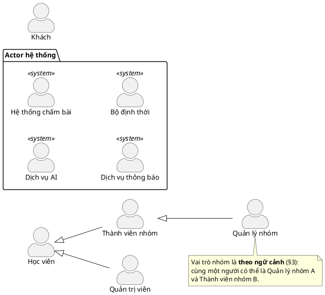

# Mô hình Actor

**5 actor chính + 4 actor hệ thống.** Mỗi actor phải thoả đồng thời hai điều kiện: có **mục tiêu
riêng** và có **use case mà không actor nào khác có**. Không thoả cả hai thì gộp hoặc bỏ.

## 1. Danh sách

### Actor chính (primary)

| # | Actor | Kế thừa | Mục tiêu riêng | Ánh xạ dữ liệu |
| --- | --- | --- | --- | --- |
| A1 | **Khách** | — | Tìm hiểu nền tảng, tạo tài khoản | *(chưa có bản ghi)* |
| A2 | **Học viên** | — | Học, luyện tập, theo dõi tiến độ | `users`, mặc định `platform_role='learner'` |
| A3 | **Thành viên nhóm** | A2 | Học cùng nhóm: nhận bài được giao, chia sẻ tài liệu | `group_members.role='member'` |
| A4 | **Quản lý nhóm** | A3 | Điều hành nhóm: giao bài, duyệt, phân quyền | `group_members.role IN ('deputy','owner')` |
| A5 | **Quản trị viên** | A2 | Vận hành nền tảng: người dùng, nội dung chính thống, kiểm duyệt | `platform_role='admin'` |

### Actor hệ thống (supporting)

Không khởi xướng gì — hệ thống gọi tới để hoàn thành use case. Vẽ **bên phải** ranh giới hệ thống.

| # | Actor | Được gọi trong | Ánh xạ dữ liệu |
| --- | --- | --- | --- |
| S1 | **Dịch vụ AI** | Hỏi đáp, phân tích lỗi, tiền kiểm tài liệu, sinh nháp bài tập | `ai_verdict`, `exercises.source='ai'` |
| S2 | **Hệ thống chấm bài** | Chạy thử, nộp bài | `submissions.verdict/runtime_ms/memory_kb`, `submission_run_details` |
| S3 | **Dịch vụ thông báo** | Xác thực email, nhắc học, nhắc hạn nộp | `users.email_verified_at`, `reminders_enabled` |
| S4 | **Bộ định thời** («Time») | Kích hoạt tác vụ theo lịch | `study_schedule_slots`, `group_exercises.due_at` |

## 2. Sơ đồ kế thừa

`Quản trị viên ⊳ Học viên` là có chủ ý: tài khoản quản trị vẫn học được, nên thừa hưởng toàn bộ
use case của học viên thay vì phải nối lại từ đầu.

## 3. Vai trò nền tảng ≠ vai trò ngữ cảnh

Điểm dễ bị chất vấn nhất. Hệ thống có **hai loại vai trò khác nhau về bản chất**:

| | Lưu ở | Tính chất | Hệ quả mô hình hoá |
| --- | --- | --- | --- |
| Vai trò nền tảng | `users.platform_role` | **Bền vững** — gắn với tài khoản | Kế thừa actor đúng nghĩa "là một" |
| Vai trò nhóm | `group_members.role` | **Theo ngữ cảnh** — theo từng nhóm | Kế thừa actor chỉ đúng *tương đối* |

Kế thừa actor trong UML nghĩa là *"là một"* vĩnh viễn. `Quản lý nhóm` **không phải một loại người** —
nó là *một học viên đang đóng vai trò đó trong một nhóm cụ thể*. Vì vậy:

- Actor A3/A4 đọc là **"Học viên đang ở vai trò X trong nhóm Y"**.
- Quyền thực tế **không** do loại actor quyết định, mà do
  `group_role_permissions` (mặc định theo vai trò, cấu hình riêng từng nhóm)
  chồng `group_member_permissions` (ghi đè theo từng người).
- Do đó **mọi use case nhóm đều gác bằng tiền điều kiện về quyền**, không gác bằng actor.

Đây chính là lý do schema tách hai tầng quyền: hai phó nhóm trong cùng một nhóm hoàn toàn có thể
có quyền khác nhau — điều mà mô hình "quyền theo vai trò" không diễn đạt được.

## 4. Actor chính hay actor phụ?

| | Actor chính | Actor phụ |
| --- | --- | --- |
| Vai trò | *Khởi xướng* use case để đạt mục tiêu của mình | Hệ thống *gọi tới* để hoàn thành use case |
| Vị trí vẽ | Trái | Phải |

**AI không phải actor chính** — nó không bao giờ tự khởi xướng:

| Tình huống | Ai khởi xướng | AI làm gì |
| --- | --- | --- |
| Hỏi đáp trợ lý | Học viên | Trả lời |
| Tiền kiểm tài liệu | Thành viên tải file lên | Phân tích, trả `ai_verdict` |
| Sinh bài tập nháp | Người soạn | Sinh nội dung |
| Gợi ý cá nhân hoá | Học viên mở trang | Xếp hạng |

## 5. Nhật ký quyết định

### Đã gộp

| Gộp từ | Thành | Lý do |
| --- | --- | --- |
| `Người dùng` *(abstract)* + `Học viên` | **`Học viên`** | Mặc định mọi tài khoản là `learner`; một actor cha trừu tượng chỉ có 2–3 con là tầng thừa |
| `Trưởng nhóm` + `Phó nhóm` | **`Quản lý nhóm`** | Cả hai cùng mục tiêu *điều hành nhóm* và cùng tập use case. Khác biệt là **mức quyền cấu hình được**, mà theo §3 thì quyền không phải tiêu chí phân actor |

Ba việc chỉ Trưởng nhóm làm được (phân quyền, chuyển quyền sở hữu, giải tán nhóm) trở thành
**tiền điều kiện** `group_members.role = 'owner'`, không phải một actor riêng. Ràng buộc
"mỗi nhóm đúng một trưởng nhóm" vẫn được CSDL cưỡng chế bằng
`uq_group_members_single_owner`.

### Đã bỏ

| Actor | Lý do bỏ |
| --- | --- |
| **Giảng viên** | Không có giao diện, quyền hay mục tiêu tách biệt: `/create-problem` hiện cho **mọi** người dùng, schema không ràng buộc `exercises.author_id` phải là mentor. Nội dung chính thống do Quản trị viên phụ trách. `courses.instructor_id` vẫn giữ — **giảng viên tồn tại như dữ liệu hiển thị, không phải actor** |
| **Kiểm duyệt viên** | Kiểm duyệt là *trách nhiệm* của Quản trị viên (nền tảng) và Quản lý nhóm (nhóm), không phải một loại người dùng. `platform_role` cũng không có giá trị tương ứng |
| **Nhà tuyển dụng** | `companies` hiện chỉ là nhãn gắn vào bài tập, không có tài khoản hay hành vi nào |
| **Hệ thống thanh toán** | Sản phẩm chưa có mô hình trả phí — không mô hình hoá chức năng chưa tồn tại |

### Đã thêm so với đề xuất ban đầu

| Actor | Bằng chứng bắt buộc phải có |
| --- | --- |
| **Khách** | `/`, `/login`, `/signup` — thiếu thì use case *Đăng ký / Đăng nhập* không thuộc về ai |
| **Hệ thống chấm bài** | `submissions.verdict/runtime_ms/memory_kb`, `exercises.time_limit_ms`, `submission_run_details.judge{worker,imageTag}` — thiếu thì không giải thích được ai sinh ra verdict |
| **Dịch vụ thông báo** | `users.email_verified_at`, `reminders_enabled/reminder_time` |
| **Bộ định thời** | `study_schedule_slots(weekday, start_time)` + index `idx_study_schedule_due` — nhắc học là use case **kích hoạt bởi thời gian**, không do người dùng bấm |
