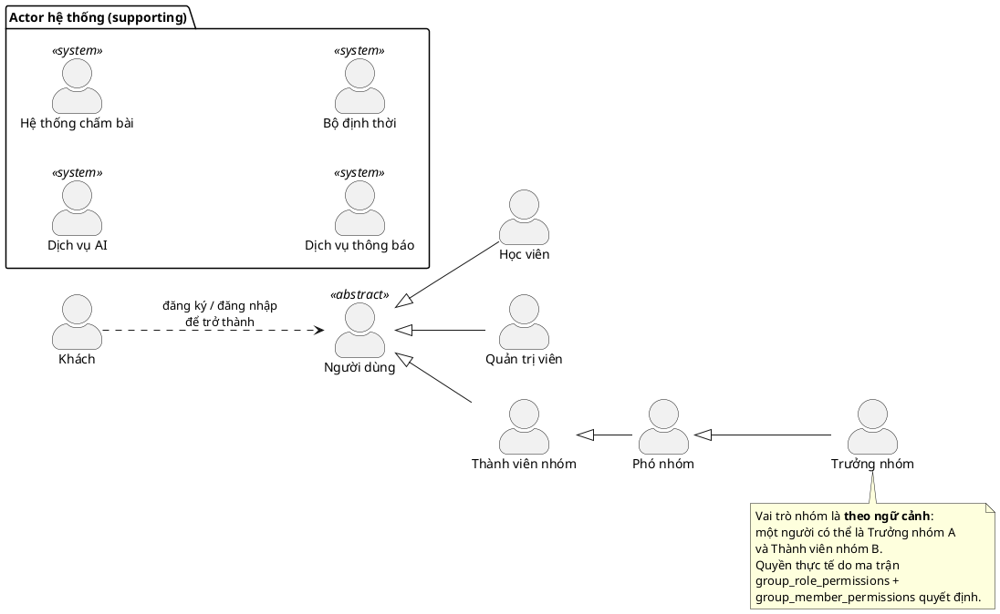

# Mô hình Actor

Rà soát danh sách actor đề xuất, đối chiếu với frontend (`codementor-frontend`) và schema đã
xây dựng ([`05-schema-reference.md`](05-schema-reference.md)), rồi chốt danh sách cuối cùng.

## 1. Rà soát danh sách bạn đề xuất

> Ghi chú nhỏ: tiêu đề ghi "4 actor" nhưng bảng liệt kê 5 dòng.

| Actor bạn đề xuất | Kết luận | Lý do |
| --- | --- | --- |
| **User** | ✅ Giữ, nhưng tách | Cần tách thành `Người dùng` (trừu tượng) và `Học viên` — vì Quản trị viên cũng là "user" nhưng mục tiêu khác hẳn |
| **Group Owner** | ⚠️ Giữ, nhưng **sai ngữ nghĩa kế thừa** | Xem §2 — đây là *vai trò theo ngữ cảnh*, không phải "is-a" vĩnh viễn |
| **Course Expert / Instructor** | ❌ **Bỏ** *(theo quyết định của bạn)* | Trùng khớp với hiện trạng hệ thống — xem §3 |
| **Admin** | ✅ Giữ | Khớp `platform_role = 'admin'`, có màn hình `/admin` |
| **AI Agent** | ⚠️ Giữ, nhưng **phân loại sai** | Đây là **actor phụ (supporting)**, không phải actor chính — xem §4 |

### Thiếu 5 actor

| Actor còn thiếu | Bằng chứng trong hệ thống | Vì sao bắt buộc phải có |
| --- | --- | --- |
| **Khách (Guest)** | `/`, `/login`, `/signup` | Không có actor này thì use case *Đăng ký / Đăng nhập* không thuộc về ai |
| **Phó nhóm (Deputy)** | `group_role` enum = `owner \| deputy \| member`; bảng `group_role_permissions` | Danh sách của bạn nhảy thẳng từ thành viên lên trưởng nhóm, bỏ mất tầng giữa có quyền cấu hình được |
| **Hệ thống chấm bài (Judge)** | `submissions.verdict/runtime_ms/memory_kb`, `exercises.time_limit_ms/memory_limit_kb`, Mongo `submission_run_details.judge{worker,imageTag,languageVersion}` | Chạy code không tin cậy là hệ thống sandbox tách biệt. Thiếu actor này thì use case *Nộp bài* không giải thích được ai sinh ra verdict |
| **Dịch vụ thông báo** | `users.email_verified_at`, `learning_preferences.reminders_enabled/reminder_time` | Gửi mail xác thực và nhắc học là hệ thống ngoài |
| **Bộ định thời (Scheduler / «Time»)** | `study_schedule_slots(weekday, start_time)` + index `idx_study_schedule_due` | Nhắc học là use case **kích hoạt bởi thời gian**, không do người dùng bấm. UML mô hình hoá bằng actor «Time» |

## 2. `Group Owner` — vấn đề ngữ nghĩa cần nói rõ khi bảo vệ

Đây là chỗ hội đồng hay hỏi. Có **hai loại vai trò** khác nhau về bản chất:

| | Lưu ở đâu | Tính chất | Mô hình hoá |
| --- | --- | --- | --- |
| Vai trò nền tảng | `users.platform_role` (`learner\|mentor\|admin`) | **Bền vững** — gắn với tài khoản | Actor generalization ✅ đúng nghĩa |
| Vai trò trong nhóm | `group_members.role` (`owner\|deputy\|member`) | **Theo ngữ cảnh** — cùng một người là trưởng nhóm A nhưng chỉ là thành viên nhóm B | Actor generalization ⚠️ chỉ đúng "tương đối" |

Quan hệ kế thừa actor trong UML mang nghĩa *"là một"* vĩnh viễn. `Trưởng nhóm` **không phải** một loại người — nó là *một người dùng đang đóng vai trò đó trong một nhóm cụ thể*.

**Cách xử lý (đã áp dụng):** vẫn vẽ `Trưởng nhóm ⊳ Phó nhóm ⊳ Thành viên nhóm` vì đây là quy ước
thực dụng mà Visual Paradigm và hầu hết tài liệu đều dùng — nhưng **phát biểu rõ** rằng:

- Actor ở đây đọc là *"Người dùng đang đóng vai trò X trong nhóm Y"*.
- Quyền thực tế **không** quyết định bởi loại actor mà bởi ma trận
  `group_role_permissions` + `group_member_permissions` (ghi đè theo từng người).
- Vì vậy mọi use case nhóm đều có **tiền điều kiện** kiểm tra quyền, chứ không dựa vào actor.

Đây chính là lý do trong schema tôi tách hai tầng quyền thay vì hard-code theo vai trò: hai phó
nhóm trong cùng một nhóm hoàn toàn có thể có quyền khác nhau.

## 3. Vì sao **không** có actor `Giảng viên`

Đây là quyết định có căn cứ, không phải bỏ sót — cần trình bày được khi bảo vệ.

**Bằng chứng từ hệ thống hiện tại:**

- `src/components/nav-items.ts` đặt `createAction = { href: "/create-problem", label: "Tạo bài tập" }`
  hiển thị cho **mọi người dùng** trong sidebar — không hề gác cổng theo vai trò.
- Schema không ràng buộc `exercises.author_id` phải là `mentor`.
- Không có màn hình nào dành riêng cho giảng viên (khác với `/admin` dành riêng cho quản trị viên).

Nghĩa là **không tồn tại một nhóm người dùng nào có mục tiêu và giao diện riêng biệt** đủ để tạo
thành một actor. Vẽ thêm actor `Giảng viên` sẽ là mô hình hoá một chức năng chưa tồn tại.

### 3.1 Vậy ai soạn nội dung?

Trách nhiệm được chia lại cho hai actor đã có:

| Phạm vi nội dung | Actor phụ trách | Ràng buộc dữ liệu |
| --- | --- | --- |
| **Chính thống** — lộ trình, khoá học, chương, bài học, bài tập trong catalog chung | **Quản trị viên** | `exercises.owner_group_id IS NULL` |
| **Phạm vi nhóm** — bài tập tự soạn để giao cho nhóm mình | **Học viên** (với vai trò trong nhóm) | `exercises.owner_group_id = <nhóm>` |

Cùng một use case *Soạn bài tập*, khác phạm vi và khác luồng duyệt — phân biệt bằng
**tiền điều kiện**, không bằng loại actor.

### 3.2 Hệ quả cần xử lý ở tầng dữ liệu

Bỏ actor kéo theo hai chỗ trong schema hiện đang phục vụ khái niệm "giảng viên":

| Đối tượng | Trạng thái | Đề xuất |
| --- | --- | --- |
| `platform_role` enum có giá trị `'mentor'` | Không còn actor nào ánh xạ tới | Giữ lại nếu sau này mở rộng, **hoặc** bỏ khỏi enum |
| `courses.instructor_id → users(id)` | Vẫn hợp lệ | **Giữ** — tên người hướng dẫn là *dữ liệu hiển thị* trên trang khoá học, không đòi hỏi người đó phải đăng nhập và thao tác |

Phân biệt quan trọng: **một giảng viên có thể tồn tại như DỮ LIỆU mà không phải là ACTOR.** Khoá
học vẫn ghi tên người biên soạn để hiển thị, nhưng nội dung do Quản trị viên nhập vào hệ thống.
Đây là tình huống hoàn toàn bình thường và không mâu thuẫn.

## 4. `AI Agent` — actor phụ, không phải actor chính

Phân biệt chuẩn UML:

- **Actor chính (primary)**: *khởi xướng* use case để đạt mục tiêu của mình.
- **Actor phụ (supporting/secondary)**: hệ thống *gọi tới* để hoàn thành use case.

AI trong CodeMentor **không bao giờ tự khởi xướng**:

| Tình huống | Ai khởi xướng | AI đóng vai |
| --- | --- | --- |
| Hỏi đáp trợ lý (`/ai-tutor`) | Học viên | Phụ — trả lời |
| Tiền kiểm tài liệu (`ai_verdict`, màn `/admin`: *"Tài liệu người dùng tải lên được AI Agent phân tích trước"*) | Thành viên tải file lên | Phụ — phân tích |
| Sinh bài tập (`exercises.source = 'ai'`) | Người soạn | Phụ — sinh nháp |
| Gợi ý cá nhân hoá (`adaptive_recommendations`) | Học viên mở trang / Scheduler | Phụ — xếp hạng |

**Quy ước vẽ (Visual Paradigm):** actor chính đặt **bên trái** hệ thống, actor phụ đặt **bên phải**.

## 5. Danh sách actor cuối cùng

### 5.1 Actor người dùng (primary)

| # | Actor | Kế thừa từ | Trách nhiệm | Ánh xạ dữ liệu |
| --- | --- | --- | --- | --- |
| A1 | **Khách** (Guest) | — | Xem giới thiệu, đăng ký, đăng nhập, khôi phục mật khẩu | chưa có bản ghi |
| A2 | **Người dùng** (Registered User) *«abstract»* | — | Hồ sơ, cài đặt, thông báo — phần chung của mọi vai trò | `users` |
| A3 | **Học viên** (Learner) | A2 | Học, luyện tập, theo dõi tiến độ, tham gia nhóm, soạn bài tập cho nhóm mình | `platform_role='learner'` |
| A4 | **Quản trị viên** (Administrator) | A2 | Quản trị người dùng, **xây dựng nội dung chính thống**, kiểm duyệt, danh mục | `platform_role='admin'` |
| A5 | **Thành viên nhóm** (Group Member) | A2 | Tham gia nhóm, nộp bài được giao, tải tài liệu | `group_members.role='member'` |
| A6 | **Phó nhóm** (Group Deputy) | A5 | Thêm quyền: duyệt bài nộp, tạo bài tập, quản lý tài liệu *(cấu hình được)* | `group_members.role='deputy'` |
| A7 | **Trưởng nhóm** (Group Owner) | A6 | Toàn quyền trong nhóm: thành viên, phân quyền, giải tán | `group_members.role='owner'` |

> **7 actor người dùng + 4 actor hệ thống = 11 actor.**

### 5.2 Actor hệ thống (supporting)

| # | Actor | Vai trò | Ánh xạ dữ liệu |
| --- | --- | --- | --- |
| S1 | **Dịch vụ AI** (AI Service) | Hỏi đáp, giải thích lỗi, tóm tắt, tiền kiểm tài liệu, sinh nháp bài tập | `ai_verdict`, `exercises.source='ai'` |
| S2 | **Hệ thống chấm bài** (Judge Service) | Biên dịch, chạy test case trong sandbox, trả verdict + tài nguyên | `submissions.verdict/runtime_ms/memory_kb`, `submission_run_details` |
| S3 | **Dịch vụ thông báo** (Notification Service) | Gửi email xác thực, nhắc học, thông báo hạn nộp | `users.email_verified_at`, `reminders_enabled` |
| S4 | **Bộ định thời** («Time») | Kích hoạt các use case theo lịch | `study_schedule_slots`, `group_exercises.due_at` |

## 6. Sơ đồ kế thừa actor

> Mũi tên nét đứt `Guest ..> User` **không phải** quan hệ UML chuẩn giữa actor — nó chỉ là ghi chú
> chuyển đổi trạng thái. Khi vẽ trong Visual Paradigm nên để dưới dạng *note* thay vì đường nối,
> tránh bị bắt lỗi ký pháp.

## 7. Những actor đã cân nhắc nhưng **không** đưa vào

Nêu ra để bảo vệ được lựa chọn:

| Actor | Vì sao loại |
| --- | --- |
| **Giảng viên** (Instructor / Course Expert) | Không có giao diện, quyền hạn hay mục tiêu nào tách biệt trong hệ thống hiện tại — chi tiết ở §3. Nội dung chính thống do Quản trị viên phụ trách; tên giảng viên vẫn tồn tại như *dữ liệu hiển thị* qua `courses.instructor_id` |
| **Kiểm duyệt viên** (Moderator) | `platform_role` chỉ có `learner\|mentor\|admin`. Kiểm duyệt là *trách nhiệm* của Quản trị viên (cấp nền tảng) và Trưởng/Phó nhóm (cấp nhóm), không phải một loại người dùng riêng. Nếu sau này tách vai trò thì thêm enum value + actor con của A2 |
| **Khách mời của nhóm** (Guest member) | Không có trạng thái nào trong `member_status` (`invited\|active\|removed`) tương ứng với quyền chỉ-xem |
| **Nhà tuyển dụng** | Bảng `companies` hiện chỉ là nhãn gắn vào bài tập, **không** có tài khoản hay hành vi nào — xem cảnh báo ở [`04-design-decisions.md`](04-design-decisions.md) |
| **Hệ thống thanh toán** | Sản phẩm chưa có mô hình trả phí. Đừng vẽ actor cho chức năng chưa tồn tại |
