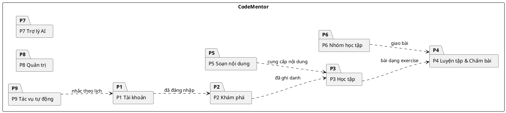
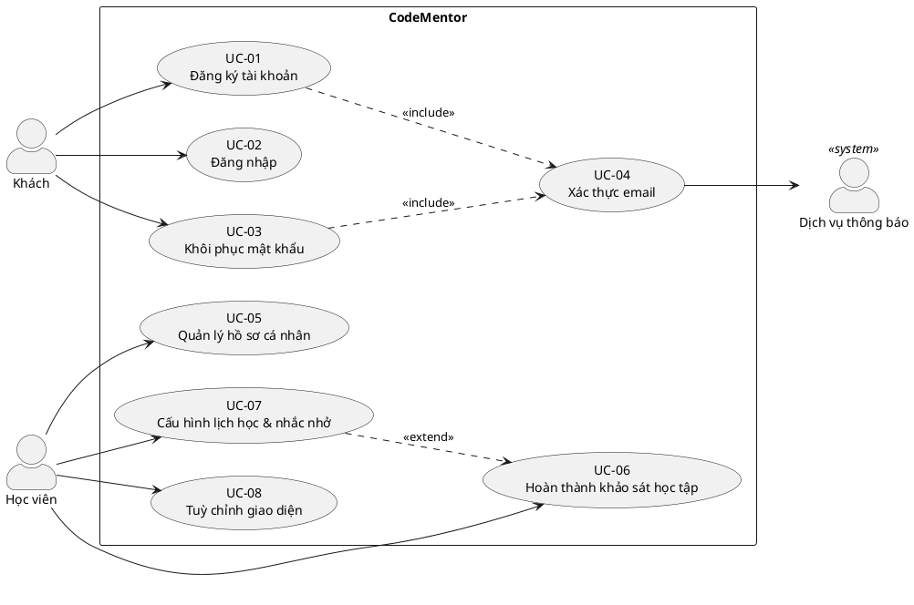
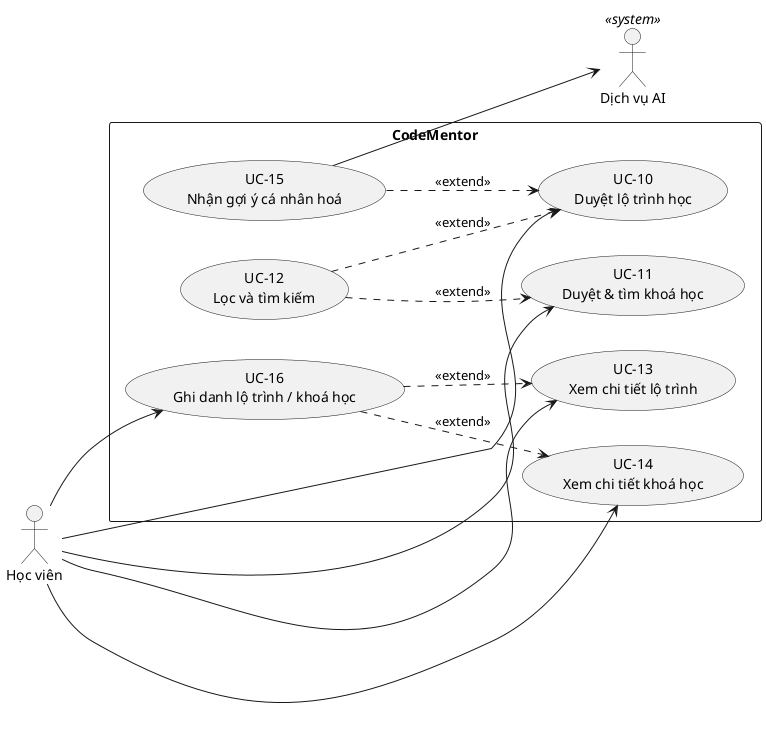
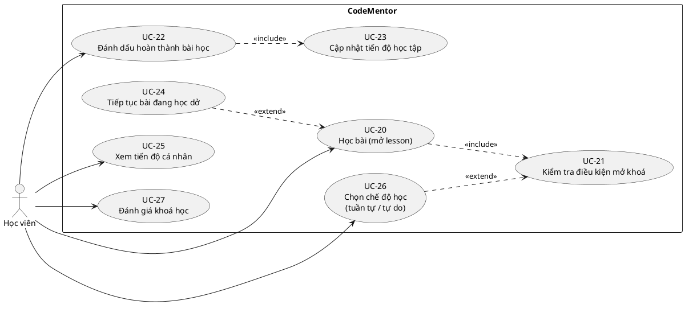
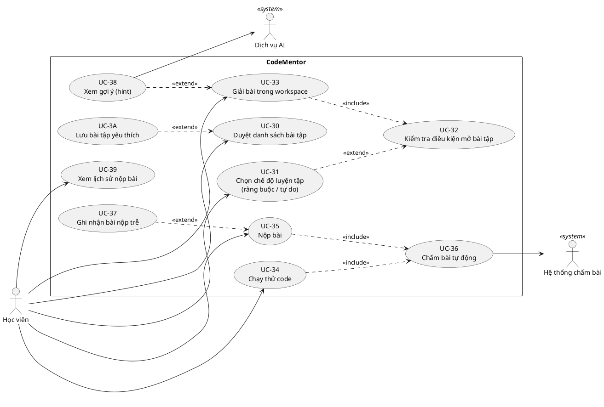
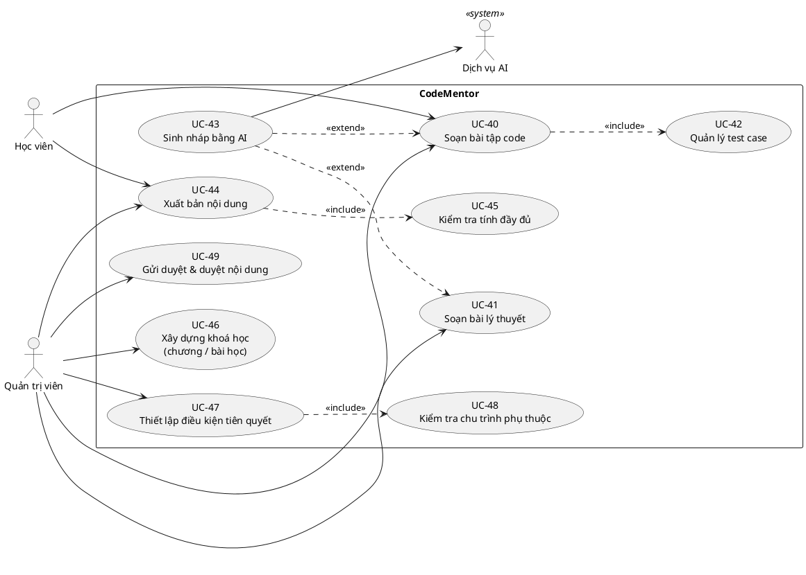
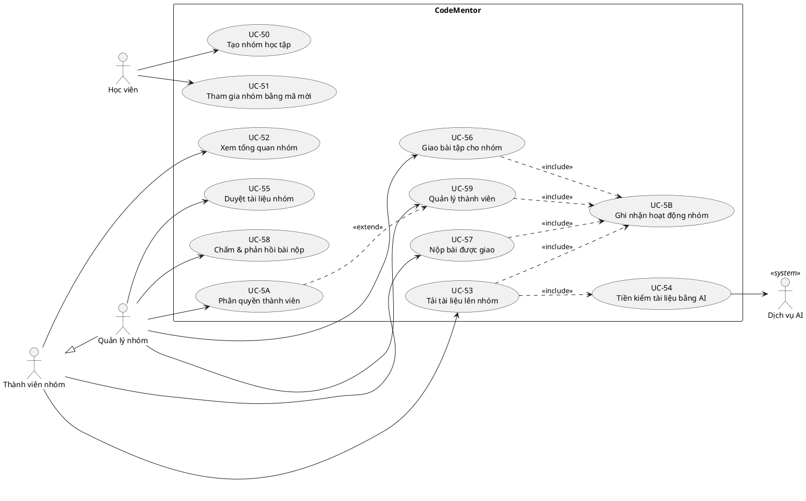
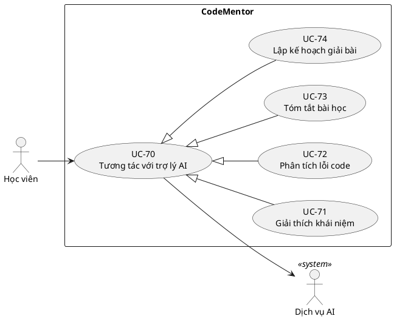
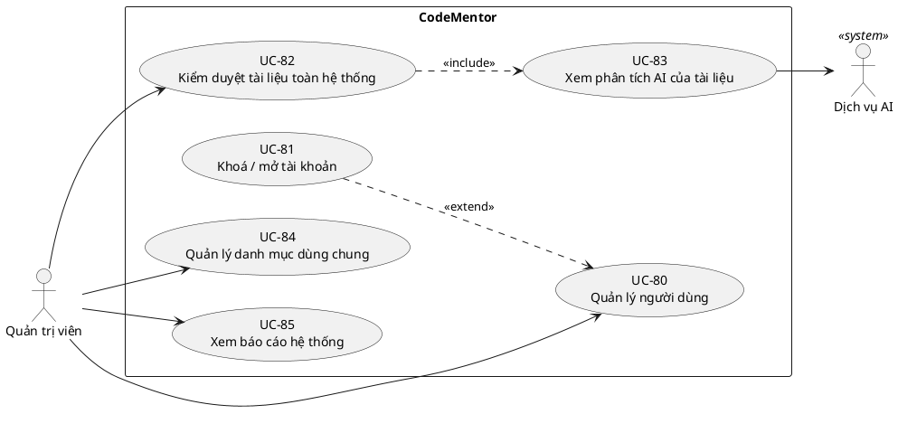
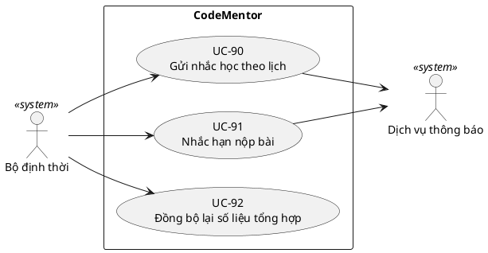

# Mô hình Use Case

Xây dựng từ [`06-actors.md`](06-actors.md), đối chiếu với route thật của frontend và schema
đã triển khai. Mọi use case dưới đây đều truy được về một màn hình hoặc một bảng dữ liệu có thật —
không có use case "vẽ cho đẹp".

Sơ đồ viết bằng **PlantUML** (Visual Paradigm import được, hoặc render tại plantuml.com).
Mermaid **không hỗ trợ** use case diagram nên không dùng ở đây.

---

## 1. Quy ước ký pháp

Phần này để đối chiếu khi vẽ lại trong Visual Paradigm — cũng là những lỗi bị bắt nhiều nhất.

### 1.1 Hướng mũi tên

| Quan hệ | Ký pháp | Hướng mũi tên | Ý nghĩa |
| --- | --- | --- | --- |
| **«include»** | nét đứt + mũi tên hở | **Base → Included** | Bắt buộc, luôn chạy. Base *không hoàn chỉnh* nếu thiếu |
| **«extend»** | nét đứt + mũi tên hở | **Extension → Base** ⚠️ | Tuỳ chọn, có điều kiện. Base *vẫn hoàn chỉnh* nếu thiếu |
| **Generalization (actor/UC)** | nét liền + tam giác rỗng | **Con → Cha** | "là một" |
| **Association** | nét liền, không mũi tên | Actor — UC | Actor tham gia use case |

> ⚠️ Mũi tên `«extend»` **ngược chiều trực giác**: nó trỏ *về* use case gốc, không phải từ gốc ra.
> Đây là lỗi phổ biến nhất.

### 1.2 Nguyên tắc đã áp dụng

1. **`«include»` chỉ dùng khi thật sự bắt buộc.** Ví dụ *Kiểm tra điều kiện mở khoá* luôn chạy khi
   mở bài học → include. Còn *Tìm kiếm* thì duyệt danh sách không cần tìm vẫn chạy được → **extend**.
2. **Mỗi `«extend»` phải có điều kiện (guard) và điểm mở rộng (extension point).** Không ghi điều
   kiện thì không phải extend.
3. **Không tách CRUD thành 4 use case.** *Quản lý thành viên* là một use case với nhiều luồng, không
   phải Thêm/Sửa/Xoá/Xem riêng lẻ — chia nhỏ như vậy chỉ làm sơ đồ rối mà không thêm thông tin.
4. **Use case phải là mục tiêu của actor**, không phải một bước thao tác. *"Bấm nút Nộp"* không phải
   use case; *"Nộp bài và nhận kết quả chấm"* mới là.
5. **Actor phụ vẽ bên phải** hệ thống, actor chính bên trái.

---

## 2. Tổng quan gói chức năng

| Gói | Mã | Số UC | Actor chính |
| --- | --- | --- | --- |
| Quản lý tài khoản & cá nhân hoá | P1 | 8 | Khách, Học viên |
| Khám phá & Lộ trình học | P2 | 7 | Học viên |
| Học tập | P3 | 8 | Học viên |
| Luyện tập & Chấm bài | P4 | 11 | Học viên |
| Soạn & Quản lý nội dung | P5 | 10 | Quản trị viên, Học viên |
| Nhóm học tập | P6 | 12 | Thành viên nhóm, Quản lý nhóm |
| Trợ lý AI | P7 | 5 | Học viên |
| Quản trị hệ thống | P8 | 6 | Quản trị viên |
| Tác vụ tự động | P9 | 3 | Bộ định thời |
| | | **70** | |

---

## 3. P1 — Quản lý tài khoản & cá nhân hoá

| Mã | Use case | Actor | Ghi chú / dữ liệu |
| --- | --- | --- | --- |
| UC-01 | Đăng ký tài khoản | Khách | `users`; «include» UC-04 |
| UC-02 | Đăng nhập | Khách | `users.password_hash` |
| UC-03 | Khôi phục mật khẩu | Khách | «include» UC-04 |
| UC-04 | Xác thực email | *(included)* | `users.email_verified_at`; gọi Dịch vụ thông báo |
| UC-05 | Quản lý hồ sơ cá nhân | Học viên | `users.display_name/bio/avatar_url/handle` |
| UC-06 | Hoàn thành khảo sát học tập | Học viên | `learning_preferences` — đầu vào cho gợi ý |
| UC-07 | Cấu hình lịch học & nhắc nhở | Học viên | `study_schedule_slots`, `reminders_enabled` |
| UC-08 | Tuỳ chỉnh giao diện | Học viên | theme (client-side) |

**Điểm mở rộng** — UC-07 *mở rộng* UC-06 tại điểm "sau khi lưu khảo sát", điều kiện `remindersEnabled = true`.

---

## 4. P2 — Khám phá & Lộ trình học

| Mã | Use case | Actor | Quan hệ | Dữ liệu |
| --- | --- | --- | --- | --- |
| UC-10 | Duyệt lộ trình học | Học viên | | `roadmaps` |
| UC-11 | Duyệt & tìm khoá học | Học viên | | `courses` |
| UC-12 | Lọc và tìm kiếm | Học viên | «extend» UC-10, UC-11 — *đk: nhập từ khoá hoặc chọn bộ lọc* | `technologies`, `tags` |
| UC-13 | Xem chi tiết lộ trình | Học viên | | `roadmap_courses`, `roadmap_outcomes` |
| UC-14 | Xem chi tiết khoá học | Học viên | | `chapters`, `lessons`, `course_reviews` |
| UC-15 | Nhận gợi ý cá nhân hoá | Học viên | «extend» UC-10 — *đk: `learning_preferences.completed_at IS NOT NULL`* | `learning_preferences` |
| UC-16 | Ghi danh lộ trình / khoá học | Học viên | «extend» từ UC-13/UC-14 — *đk: bấm "Bắt đầu học"* | `roadmap_enrollments`, `course_enrollments` |

> UC-12 là **extend chứ không phải include**: mở trang lộ trình mà không lọc gì vẫn là một luồng
> hoàn chỉnh. Đây là chỗ rất hay bị vẽ nhầm thành include.

---

## 5. P3 — Học tập

| Mã | Use case | Quan hệ | Dữ liệu / hiện thực |
| --- | --- | --- | --- |
| UC-20 | Học bài (mở lesson) | «include» UC-21 | `lessons`, Mongo `lesson_contents` |
| UC-21 | **Kiểm tra điều kiện mở khoá** | *(included)* | `fn_lesson_available()` — thay thế hoàn toàn cờ `isLocked` cũ |
| UC-22 | Đánh dấu hoàn thành bài học | «include» UC-23 | `lesson_progress.status='completed'` |
| UC-23 | **Cập nhật tiến độ học tập** | *(included)* | trigger `fn_refresh_course_progress` → `fn_refresh_roadmap_progress` |
| UC-24 | Tiếp tục bài đang học dở | «extend» UC-20 — *đk: tồn tại lesson `in_progress`* | `idx_lesson_progress_active` |
| UC-25 | Xem tiến độ cá nhân | | `course_enrollments.progress_percent` |
| UC-26 | Chọn chế độ học | «extend» UC-21 — *đk: học viên đổi chế độ* | `course_enrollments.mode_override` |
| UC-27 | Đánh giá khoá học | | `course_reviews` → trigger cập nhật `rating_avg` |

**Điểm nhấn khi bảo vệ:** UC-21 là hiện thân trực tiếp của thiết kế "tách thứ tự hiển thị khỏi
điều kiện tiên quyết". UC-26 là hiện thân của yêu cầu *học có ràng buộc / không ràng buộc* mà
không nhân bản nội dung.

---

## 6. P4 — Luyện tập & Chấm bài

| Mã | Use case | Quan hệ | Dữ liệu / hiện thực |
| --- | --- | --- | --- |
| UC-30 | Duyệt danh sách bài tập | | `exercises`, `exercise_set_items` |
| UC-31 | Chọn chế độ luyện tập | «extend» UC-32 — *đk: học viên đổi chế độ* | `exercise_set_enrollments.progression_mode_override` |
| UC-32 | **Kiểm tra điều kiện mở bài tập** | *(included)* | `fn_exercise_available(user, set, exercise)` |
| UC-33 | Giải bài trong workspace | «include» UC-32 | Mongo `exercise_contents` |
| UC-34 | Chạy thử code | «include» UC-36 | chỉ chạy test `visibility='public'` |
| UC-35 | Nộp bài | «include» UC-36 | `submissions` |
| UC-36 | **Chấm bài tự động** | *(included)* | Judge Service → `verdict`, `runtime_ms`, `memory_kb`, Mongo `submission_run_details` |
| UC-37 | Ghi nhận bài nộp trễ | «extend» UC-35 — *đk: `now() > due_at AND allow_late_submission`* | `submissions.is_late` |
| UC-38 | Xem gợi ý (hint) | «extend» UC-33 — *đk: học viên yêu cầu* | Mongo `hints[].xpPenalty` |
| UC-39 | Xem lịch sử nộp bài | | `idx_submissions_user_recent` |
| UC-3A | Lưu bài tập yêu thích | «extend» UC-30 | `exercise_progress.is_favorite` |

---

## 7. P5 — Soạn & Quản lý nội dung

Nội dung **chính thống** (lộ trình, khoá học, chương, bài học, bài tập catalog) do **Quản trị viên**
phụ trách. **Học viên** chỉ soạn được bài tập **phạm vi nhóm** — phân biệt bằng tiền điều kiện
`exercises.owner_group_id`, không phải bằng loại actor. Xem [`06-actors.md §3`](06-actors.md).

| Mã | Use case | Actor | Quan hệ | Dữ liệu |
| --- | --- | --- | --- | --- |
| UC-40 | Soạn bài tập code | Quản trị viên, Học viên¹ | «include» UC-42 | `exercises`, Mongo `exercise_contents` |
| UC-41 | Soạn bài lý thuyết | Quản trị viên | | `kind='theory'` |
| UC-42 | Quản lý test case | *(included)* | | `testCases[]` (public/hidden, generated) |
| UC-43 | Sinh nháp bằng AI | Quản trị viên, Học viên | «extend» UC-40, UC-41 — *đk: chọn "Tạo bằng AI"* | `exercises.source='ai'` |
| UC-44 | Xuất bản nội dung | Quản trị viên, Học viên¹ | «include» UC-45 | `status='published'` |
| UC-45 | **Kiểm tra tính đầy đủ** | *(included)* | | CHECK `status<>'published' OR content_ref IS NOT NULL` |
| UC-46 | Xây dựng khoá học | Quản trị viên | | `chapters`, `lessons` |
| UC-47 | Thiết lập điều kiện tiên quyết | Quản trị viên | «include» UC-48 | 5 bảng `*_prerequisites` |
| UC-48 | **Kiểm tra chu trình phụ thuộc** | *(included)* | | trigger `fn_prevent_dependency_cycle` |
| UC-49 | Gửi duyệt & duyệt nội dung | Quản trị viên | | `exercise_status` (`pending_review` → `published`/`changes_requested`/`rejected`) |

¹ **Tiền điều kiện phân biệt phạm vi**, không phải actor: `owner_group_id IS NULL` → catalog chung
(chỉ Quản trị viên); `owner_group_id = <nhóm>` → nội bộ nhóm (Học viên có quyền `createExercise`).

---

## 8. P6 — Nhóm học tập

| Mã | Use case | Actor | Quan hệ | Dữ liệu |
| --- | --- | --- | --- | --- |
| UC-50 | Tạo nhóm học tập | Học viên → thành Quản lý nhóm | | `study_groups`, `group_members(role='owner')` |
| UC-51 | Tham gia nhóm bằng mã mời | Học viên | | `study_groups.invite_code` |
| UC-52 | Xem tổng quan nhóm | Thành viên | | `member_count`, `submissionTrend` |
| UC-53 | Tải tài liệu lên nhóm | Thành viên¹ | «include» UC-54, UC-5B | `group_documents` |
| UC-54 | **Tiền kiểm tài liệu bằng AI** | *(included)* | | `group_documents.ai_verdict` |
| UC-55 | Duyệt tài liệu nhóm | Quản lý nhóm¹ | | `document_status`, `reviewed_by` |
| UC-56 | Giao bài tập cho nhóm | Quản lý nhóm¹ | «include» UC-5B | `group_exercises`, `assignments` |
| UC-57 | Nộp bài được giao | Thành viên | «include» UC-5B | `submissions.assignment_id` |
| UC-58 | Chấm & phản hồi bài nộp | Quản lý nhóm¹ | | `assignments.review_status/feedback` |
| UC-59 | Quản lý thành viên | Quản lý nhóm² | «include» UC-5B | `group_members` |
| UC-5A | Phân quyền thành viên | Quản lý nhóm² | «extend» UC-59 | `group_role_permissions` + `group_member_permissions` |
| UC-5B | **Ghi nhận hoạt động nhóm** | *(included)* | | `group_activities` |

¹ **Tiền điều kiện là quyền, không phải actor.** UC-53 gắn với `Thành viên nhóm` nhưng chỉ chạy
được khi `effectiveMemberPermissions(member).uploadDoc = true`. Một người bị gỡ quyền `deleteDoc`
vẫn giữ nguyên vai trò của mình. Xem [`06-actors.md §3`](06-actors.md).

² **Chỉ Trưởng nhóm** — tiền điều kiện `group_members.role = 'owner'`. Đây là lý do
`Trưởng nhóm` không cần là actor riêng: khác biệt duy nhất so với Phó nhóm nằm ở tiền điều kiện
của ba use case, không phải ở mục tiêu hay tập chức năng. Ràng buộc *mỗi nhóm đúng một trưởng nhóm*
do CSDL cưỡng chế bằng `uq_group_members_single_owner`.

---

## 9. P7 — Trợ lý AI

Ở đây dùng **generalization giữa các use case**: bốn kịch bản là các dạng chuyên biệt của một
tương tác chung, chứ không phải bốn use case rời rạc.

| Mã | Use case | Nguồn trong frontend |
| --- | --- | --- |
| UC-70 | Tương tác với trợ lý AI *(cha)* | `/ai-tutor` |
| UC-71 | Giải thích khái niệm | *"Gỡ rối khái niệm — Diễn giải theo cách dễ hiểu"* |
| UC-72 | Phân tích lỗi code | *"Phân tích lỗi code — Tìm nguyên nhân trước khi sửa"* |
| UC-73 | Tóm tắt bài học | *"Tóm tắt bài đang học — Rút ra ý chính"* |
| UC-74 | Lập kế hoạch giải bài | *"Lập kế hoạch giải bài — Chia nhỏ bước tư duy"* |

UC-72 cũng là điểm mở rộng của UC-35 (Nộp bài) khi `verdict <> 'accepted'`.

---

## 10. P8 — Quản trị hệ thống

| Mã | Use case | Quan hệ | Dữ liệu |
| --- | --- | --- | --- |
| UC-80 | Quản lý người dùng | | `users.role/status` |
| UC-81 | Khoá / mở tài khoản | «extend» UC-80 — *đk: vi phạm* | `account_status` |
| UC-82 | Kiểm duyệt tài liệu toàn hệ thống | «include» UC-83 | `/admin`, `document_status` |
| UC-83 | **Xem phân tích AI của tài liệu** | *(included)* | `ai_verdict` |
| UC-84 | Quản lý danh mục dùng chung | | `technologies`, `tags`, `companies` |
| UC-85 | Xem báo cáo hệ thống | | các cột CACHE |

---

## 11. P9 — Tác vụ tự động (kích hoạt bởi thời gian)

| Mã | Use case | Dữ liệu |
| --- | --- | --- |
| UC-90 | Gửi nhắc học theo lịch | `study_schedule_slots` + `idx_study_schedule_due` |
| UC-91 | Nhắc hạn nộp bài | `group_exercises.due_at` |
| UC-92 | Đồng bộ lại số liệu tổng hợp | `postgres/verify.sql` — đối chiếu cache với nguồn sự thật |

---

## 12. Tổng hợp quan hệ

### 12.1 «include» — 14 quan hệ

| Base | → Included | Vì sao **bắt buộc** |
| --- | --- | --- |
| UC-01, UC-03 | UC-04 Xác thực email | Không xác thực thì tài khoản chưa dùng được |
| UC-20 | UC-21 Kiểm tra điều kiện mở khoá | Luôn phải kiểm tra trước khi hiển thị nội dung |
| UC-22 | UC-23 Cập nhật tiến độ | Hoàn thành mà không cập nhật là vô nghĩa |
| UC-33 | UC-32 Kiểm tra điều kiện mở bài tập | Như UC-21 |
| UC-34, UC-35 | UC-36 Chấm bài | Không chấm thì không có kết quả |
| UC-40 | UC-42 Quản lý test case | Bài code không có test case thì không chấm được |
| UC-44 | UC-45 Kiểm tra tính đầy đủ | Ràng buộc CHECK ở CSDL |
| UC-47 | UC-48 Kiểm tra chu trình | Trigger, không thể bỏ qua |
| UC-53 | UC-54 Tiền kiểm AI | Màn `/admin` nêu rõ *"được AI Agent phân tích trước"* |
| UC-53, 56, 57, 59 | UC-5B Ghi nhận hoạt động | Mọi hành động nhóm đều lên activity feed |
| UC-82 | UC-83 Xem phân tích AI | Quyết định kiểm duyệt dựa trên kết quả AI |

### 12.2 «extend» — 13 quan hệ

| Extension | → Base | Điều kiện (guard) |
| --- | --- | --- |
| UC-07 | UC-06 | `remindersEnabled = true` |
| UC-12 | UC-10, UC-11 | người dùng nhập từ khoá / chọn bộ lọc |
| UC-15 | UC-10 | `learning_preferences.completed_at IS NOT NULL` |
| UC-16 | UC-13, UC-14 | bấm "Bắt đầu học" |
| UC-24 | UC-20 | tồn tại bài `in_progress` |
| UC-26 | UC-21 | học viên đổi chế độ học |
| UC-31 | UC-32 | học viên đổi chế độ luyện tập |
| UC-37 | UC-35 | `now() > due_at AND allow_late_submission` |
| UC-38 | UC-33 | học viên bấm xem gợi ý (trừ XP) |
| UC-3A | UC-30 | bấm lưu yêu thích |
| UC-43 | UC-40, UC-41 | chọn "Tạo bằng AI" |
| UC-5A | UC-59 | mở tab phân quyền |
| UC-81 | UC-80 | tài khoản vi phạm |

### 12.3 Generalization giữa use case

`UC-70 Tương tác với trợ lý AI` ⊳ `UC-71`, `UC-72`, `UC-73`, `UC-74`.

---

## 13. Ma trận truy vết Use case → Cơ sở dữ liệu

Bảng này chứng minh mọi use case đều có chỗ dựa dữ liệu — và ngược lại, không có bảng nào thừa.

| Use case | Bảng PostgreSQL | Collection MongoDB | Hàm / trigger |
| --- | --- | --- | --- |
| UC-01…05 | `users` | | |
| UC-06, 07 | `learning_preferences`, `study_schedule_slots` | | |
| UC-10…14 | `roadmaps`, `courses`, `chapters`, `lessons` | | |
| UC-15 | `learning_preferences`, `roadmap_technologies` | | |
| UC-16 | `roadmap_enrollments`, `course_enrollments` | | |
| UC-20 | `lessons` | `lesson_contents` | |
| **UC-21** | `lesson_prerequisites`, `chapter_prerequisites` | | `fn_lesson_available`, `fn_chapter_available` |
| UC-22, 23 | `lesson_progress` | | `fn_refresh_course_progress`, `fn_refresh_roadmap_progress` |
| UC-26 | `course_enrollments.mode_override` | | |
| UC-27 | `course_reviews` | | `fn_on_course_review_change` |
| UC-30 | `exercises`, `exercise_set_items` | | |
| UC-31 | `exercise_set_enrollments` | | |
| **UC-32** | `exercise_prerequisites` | | `fn_exercise_available` |
| UC-33, 38 | | `exercise_contents` | |
| UC-34…37 | `submissions`, `exercise_progress` | `submission_run_details` | |
| UC-40…43 | `exercises`, `exercise_tags` | `exercise_contents` | |
| UC-44, 45 | | | CHECK `exercises_published_needs_content` |
| UC-46 | `chapters`, `lessons` | | `fn_on_curriculum_change` |
| **UC-47, 48** | 5 bảng `*_prerequisites` | | `fn_prevent_dependency_cycle` |
| UC-50…52 | `study_groups`, `group_members` | | `fn_on_group_member_change` |
| UC-53…55 | `group_documents` | | |
| UC-56…58 | `group_exercises`, `assignments`, `submissions` | | |
| UC-59, 5A | `group_role_permissions`, `group_member_permissions` | | |
| UC-5B | `group_activities` | | |
| UC-70…74 | | | *(dịch vụ ngoài)* |
| UC-80…85 | `users`, `group_documents`, `technologies`, `tags` | | |
| UC-90, 91 | `study_schedule_slots`, `group_exercises.due_at` | | |
| UC-92 | | | `postgres/verify.sql` |

**Bảng chưa có use case nào dùng tới:** `companies`, `exercise_companies` — đúng như cảnh báo ở
[`04-design-decisions.md §11`](04-design-decisions.md). Đây là bằng chứng khách quan cho việc nên
bỏ hai bảng này, hoặc bổ sung use case *"Lọc bài tập theo công ty"* nếu quyết định giữ.
